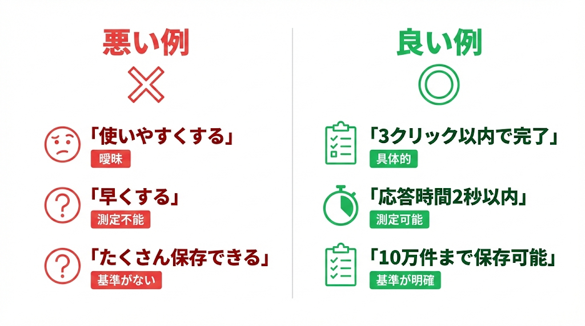
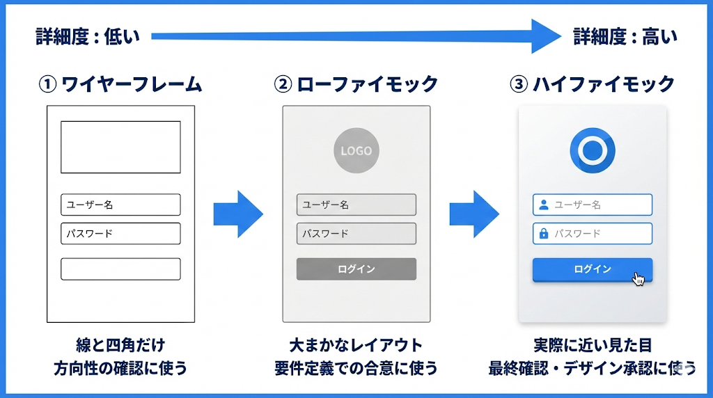

# 要件の文書化

出典: 「要件定義の教科書」（tan_go238）第3部

## 機能要件書を書く

### 曖昧な言葉を排除する

「曖昧な言葉は、後で揉める言葉」

| 悪い例 | 問題点 | 良い例 |
|-------|--------|-------|
| 使いやすくする | 基準がない | 3クリック以内で完了 |
| 早くする | 測定できない | 応答時間2秒以内 |
| たくさん保存できる | 曖昧 | 10万件まで保存可能 |

数字を入れると具体的になり、テストもでき、お客さんとも認識が合う。

### 機能一覧表の書き方

| 項目 | 説明 | 例 |
|------|------|-----|
| 機能ID | 一意の識別子 | F-001 |
| 機能名 | 機能の名前 | ユーザー登録 |
| 機能概要 | 何ができるか | 新規ユーザーの情報を登録する |
| 優先度 | 必須か任意か | 必須 / 任意 |
| 関連画面 | どの画面で使うか | ユーザー登録画面 |
| 備考 | 補足情報 | 管理者のみ実行可能 |

曖昧だと、開発者は余裕を持って多めに見積もるか、足りなくて後で揉めるかのどちらか。

### ユースケースの構成要素

複雑な機能は、ユースケースとして詳細化する。

- **アクター**: 誰が使うか（例: 申請者）
- **事前条件**: この機能を使う前の状態（例: ログイン済み）
- **基本フロー**: 正常な流れ
- **代替フロー**: 分岐する場合の流れ
- **例外フロー**: エラーの場合の流れ
- **事後条件**: この機能を使った後の状態

### 画面一覧・帳票一覧

| 項目 | 画面一覧 | 帳票一覧 |
|------|---------|---------|
| ID | S-001 | R-001 |
| 名称 | ユーザー登録画面 | 月次売上レポート |
| 概要 | ユーザー情報を入力する | 月ごとの売上を出力 |
| アクセス権限 | 管理者のみ | 全ユーザー |
| 出力形式 | - | PDF / Excel |

## 画面モックで「見える化」する

### 文章だけでは認識がズレる

| 文章での定義 | 開発者の解釈 | 顧客の期待 |
|-----------|-----------|----------|
| 一覧表示 | 10件ずつページング | 全件を無限スクロール |
| 検索機能 | テキストボックス1つ | 日付・ステータス等の複合検索 |
| 編集可能 | 別画面で編集 | 一覧上で直接編集（インライン） |
| ステータス表示 | テキストで「承認済」 | 色付きバッジでアイコン表示 |

文章で書くと「検索機能」の5文字で終わる。実装するには100個くらい決めることがある。

### モックの3段階

| 段階 | 名前 | 特徴 | 使う場面 |
|------|------|------|---------|
| 1 | ワイヤーフレーム | 線と四角だけ。色なし | 最初の方向性確認 |
| 2 | ローファイモック | 大まかなレイアウト。グレー中心 | 要件定義での合意形成 |
| 3 | ハイファイモック | 実際に近い見た目。色・画像あり | 最終確認・デザイン承認 |

要件定義段階では2のローファイで十分。キレイにしすぎると「デザインの話」になる。今決めたいのは「何を置くか」であって「どんな色にするか」ではない。

### モックを使った合意形成の進め方

1. ヒアリングで大まかな要望を聞く
2. ワイヤーフレームで方向性を確認「こんな感じで合ってますか？」
3. フィードバックを反映
4. ローファイモックで詳細を詰める「この項目で足りますか？」
5. 画面定義書にモックを添付して正式合意

50%の段階で見せて、方向性が合ってるか確認する。「未完成のものを見せる勇気」が必要。

### モック作成の注意点

| やりがちな失敗 | 正しいアプローチ |
|-------------|-------------|
| 1画面だけ見せる | 画面遷移の流れで見せる |
| 正常系だけ作る | エラー時・データ0件時も作る |
| ダミーデータが適当 | 実際に近いデータで作る |
| 細部にこだわりすぎ | まずは全体の流れを優先 |
| モックだけ渡す | 口頭で説明しながら見せる |

### 画面定義書 + モック = 最強

| ドキュメント | 役割 |
|------------|------|
| 画面定義書（文章） | 仕様の正式な記録。検索条件、バリデーション等を明記 |
| 画面モック | 視覚的な合意形成。「これで合ってますよね」の確認 |

文章は「契約」、モックは「コミュニケーションツール」。両方あって初めて認識がズレない。

## 非機能要件を忘れるな

### 非機能要件の6大カテゴリ

| カテゴリ | 内容 | 例 |
|---------|------|-----|
| 可用性 | どのくらい止まらないか | 稼働率99.9%、計画停止は月1回まで |
| 性能 | どのくらい早いか | 応答時間2秒以内、同時接続100人 |
| 拡張性 | 将来の拡張に対応できるか | ユーザー数10倍でも対応可 |
| 運用保守 | 運用しやすいか | ログ出力、監視機能、バックアップ |
| 移行性 | データ移行できるか | 旧システムから3年分のデータ移行 |
| セキュリティ | 安全か | 通信暗号化、アクセス制御、監査ログ |

全部を最高レベルにする必要はない。システムの特性に合わせてメリハリをつける。

### IPA 非機能要求グレード

IPA（情報処理推進機構）の「非機能要求グレード」で体系的に整理できる。まずシステムの「社会的影響度」を決め、それに応じたレベルを設定する。

公式サイト: https://www.ipa.go.jp/sec/softwareengineering/reports/20100416.html

### 「当たり前」を明文化する

「普通」の定義は人によって違う。明文化しないと揉める。

明文化すべき「当たり前」の例:
- 日本語で表示される
- ブラウザの戻るボタンが使える
- パスワードは暗号化して保存する
- タイムアウトしたら再ログインが必要

## 要件定義書をまとめる

### 要件定義書の標準構成

1. エグゼクティブサマリー（1ページで全体像）
2. プロジェクト概要（目的、背景、スコープ）
3. ステークホルダー一覧
4. 業務フロー図（As-Is / To-Be）
5. 機能要件（機能一覧、ユースケース）
6. 画面一覧・画面モック
7. 帳票一覧
8. 非機能要件
9. 制約条件・前提条件
10. 用語集

### 読み手を意識した書き方

| 読み手 | 関心事 | 読むべきセクション |
|--------|-------|----------------|
| 経営層 | コスト、効果、スケジュール | サマリー、プロジェクト概要 |
| 業務部門 | 業務がどう変わるか | 業務フロー、画面モック |
| 開発チーム | 何を作ればいいか | 機能要件、非機能要件、画面定義 |

読み手によって読む深さが違っていい。

### レビューとサインオフ

**レビューの観点**:
- 用語は統一されているか
- 機能間で矛盾はないか
- 抜け漏れはないか（特に例外ケース）
- 実現可能性に問題はないか

**サインオフ**: 「この内容で合意しました」という証拠を残す。メールでも承認印でもよい。お互いを守るための手続き。
