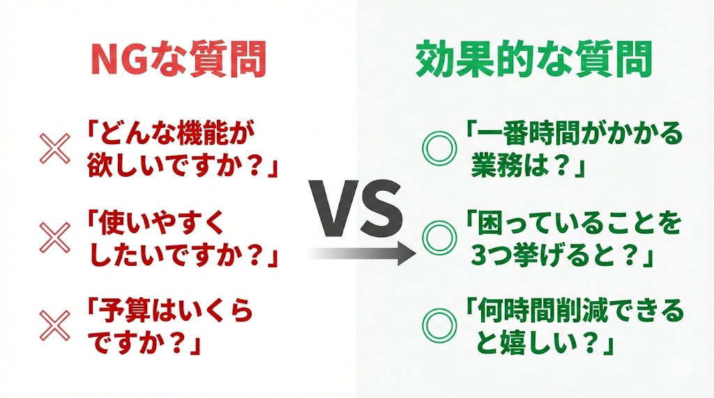
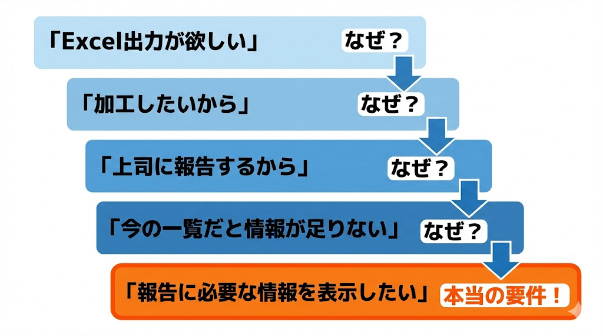
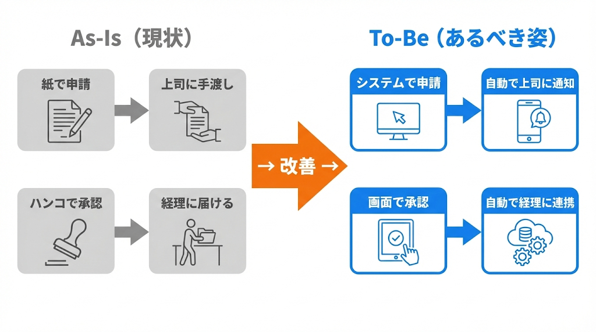
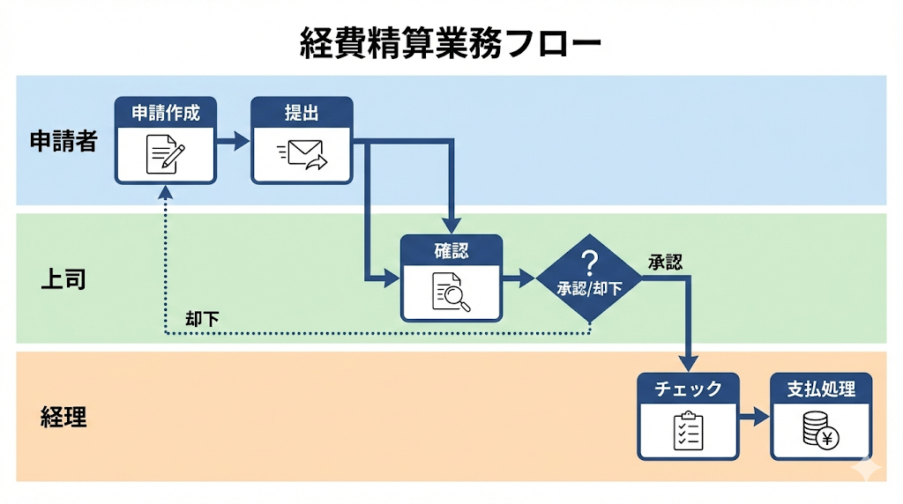

# 要件の引き出し技術

出典: 「要件定義の教科書」（tan_go238）第2部

## ヒアリングの技術

### 良い質問と悪い質問

| 悪い質問 | 問題点 | 良い質問 |
|---------|--------|---------|
| どんな機能が欲しいですか？ | 相手が答えを持っていない | 今、一番時間がかかっている業務は何ですか？ |
| 使いやすくしたいですか？ | Yes以外の答えがない | 今のシステムで困っていることを3つ挙げるとしたら？ |
| 予算はいくらですか？ | いきなりお金の話は警戒される | このシステムで月に何時間くらい削減できると嬉しいですか？ |

「任せる」は危険信号。お客さんが「任せる」と言うのは信頼ではなく「自分でもわからない」ということ。こちらから仮説をぶつけて引き出す。

### なぜの深掘り

表面的な要望の裏に本当のニーズがある。「なぜ？」を繰り返すことで、それが見えてくる。

例:
1. 「Excel出力が欲しい」→ なぜ？
2. 「加工したいから」→ なぜ加工したい？
3. 「上司に報告するから」→ なぜ加工しないと報告できない？
4. 「今の一覧だと情報が足りないから」
5. → 本当の要件は「報告に必要な情報を表示する」

### 議事録は合意の証拠

議事録に書くべきこと:
- 日時、場所、参加者
- 議題と結論
- 決定事項（誰が、いつまでに、何をするか）
- 未決事項（次回までに確認すること）
- 認識合わせした内容

ヒアリング終わりに「今日決まったことを確認させてください」と復唱する。議事録は「言った言わない」を防ぐだけでなく、認識のズレを早期発見するためのレビュー機会。

## 業務フローを描いて合意する

### なぜ業務フローが先なのか

画面は「業務フローの一部を切り取ったもの」。全体の流れが見えてないと、切り取り方を間違える。業務フローがズレていたら、作った画面も全部ズレる。

### As-Is（現状）と To-Be（あるべき姿）

| フロー | 目的 | 描くタイミング |
|--------|------|-------------|
| As-Is（現状） | 今の業務を可視化する | ヒアリング後すぐ |
| To-Be（あるべき姿） | システム化後の業務を可視化する | 要件が固まってきたら |

現状を知らないと、何を変えるべきかわからない。非効率に見えても、実は必要なチェックだったりする。

### 業務フロー図の描き方

業務フロー図に必要な要素:
- **アクター**（誰が）: 申請者、上司、経理など
- **アクション**（何をする）: 申請する、承認する、差し戻すなど
- **分岐**（条件）: 金額が10万円以上なら、など
- **成果物**（何ができる）: 申請書、承認済み伝票など

スイムレーンを使う。縦に担当者を並べて、横に時間の流れを描く。

### 例外ケースを聞き出す

例外は「滅多に起きない」が「起きたら致命的」。正常系は誰でも想像できるが、例外は「起きてみないとわからない」ことが多い。

| 質問 | 引き出せる例外 |
|------|-------------|
| 「承認者が休みの時はどうしますか？」 | 代理承認フロー |
| 「急ぎの場合はどうしますか？」 | 緊急時の承認スキップ |
| 「間違えて登録した場合は？」 | 取消・修正フロー |
| 「却下された後はどうなりますか？」 | 再申請フロー |
| 「年度末など特殊な時期は？」 | 期間限定の特殊ルール |

お客さんにとっては「当たり前」だから、わざわざ言わない。こちらから聞きに行く姿勢が必要。

### 業務フローの合意を取る

「見せる」だけでなく「合意」を取る。「このフローで間違いないですね？この前提で進めていいですね？」と明確に確認する。メールか議事録で証拠を残す。

### レビュー会を開く

関係者を集めてレビュー会を開く理由:
- 部署間の認識ズレを発見できる
- その場で議論して解決できる
- 「みんなで確認した」という合意の証拠になる

同じ会社でも自分の担当範囲しか知らないことが多い。申請部門は「提出したら終わり」、経理部門は「届いてから3つのチェックがある」など。

### 業務フローから画面を導き出す

業務フローが決まると、必要な画面が自然と見えてくる。フローの各ステップで「誰が」「何をするか」を考えると、必要な画面が洗い出せる。

例（経費精算）:
- 申請者向け: 申請入力画面、申請履歴画面、下書き保存画面
- 上司向け: 承認一覧画面、承認詳細画面、却下理由入力画面
- 経理向け: 経理確認一覧、支払処理画面、差戻し画面

## 本当に欲しいものは言葉にならない

### 「〇〇みたいに」の危険性

| お客さんの表現 | 考えられる意味 |
|-------------|-------------|
| Excelみたいに | 一覧編集、計算、コピペ、自由なレイアウト... |
| LINEみたいに | リアルタイム、既読、スタンプ、グループ... |
| Amazonみたいに | レコメンド、ワンクリック購入、レビュー... |
| サクサク動く | 応答速度、画面遷移の少なさ、先読み... |

同じ言葉でも人によって想像するものが違う。「具体的には？」と必ず聞く。

### 手段と目的を見極める

お客さんが言う「要望」は、実は「手段」であることが多い。

- 「Excel出力が欲しい」→ 手段。目的は「上司に報告したい」
- 目的がわかれば別の手段も提案できる（レポート機能、ダッシュボードなど）

手段と目的を見極める質問:
- 「それができると、何が嬉しいですか？」
- 「それがないと、何が困りますか？」
- 「今はその作業、どうやっていますか？」

### ユーザーは自分のニーズを言語化できない

「もし顧客に何が欲しいか尋ねたら、彼らは速い馬が欲しいと答えただろう」（ヘンリー・フォードの言葉とされる）

お客さんは「より良い現状」は想像できても、「まったく新しい解決策」は想像できない。課題を理解した上で提案する。押しつけはNG。
