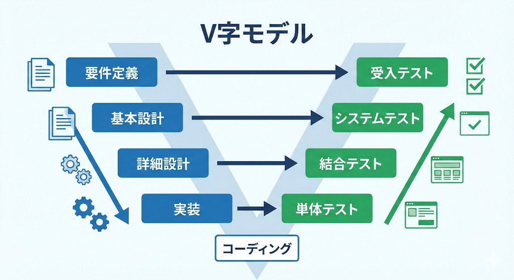
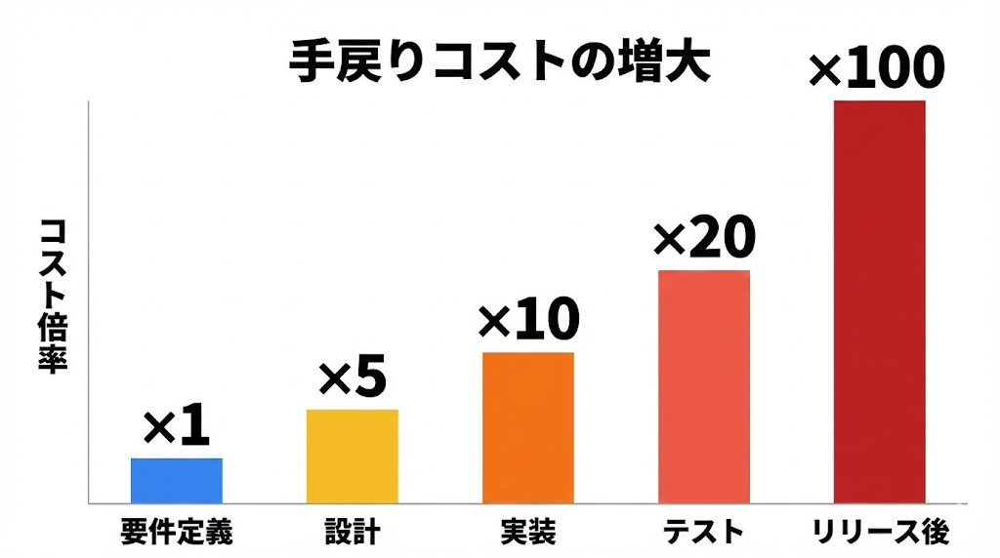
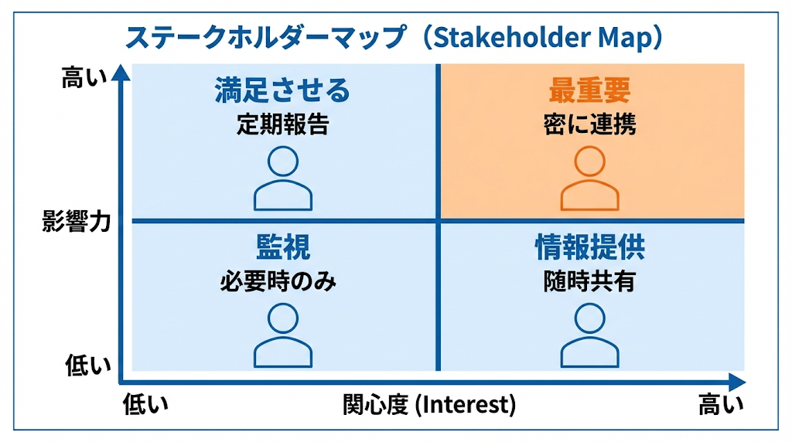

# 要件定義の基礎概念

出典: 「要件定義の教科書」（tan_go238）第1部

## システム開発の全体像

システム開発は以下の工程で進む。要件定義は最初の工程であり、ここがグラグラすると後の工程が全部グラグラする。

1. **要件定義** — 何を作るかを決める
2. **設計** — どう作るかを決める
3. **実装** — 実際に作る
4. **テスト** — 正しく作れたか確認する
5. **リリース** — 本番稼働させる

### V字モデル

開発工程とテスト工程の対応関係を示すモデル。要件定義で決めたことは、最終的にユーザー受入テストで検証される。要件定義が曖昧だと「何をもって完成とするか」が決められない。

### 手戻りコストの法則

要件定義段階で見つかった問題を1とすると：

| 発見フェーズ | コスト倍率 |
|------------|----------|
| 要件定義 | x1 |
| 設計 | x5 |
| 実装 | x10 |
| テスト | x20 |
| リリース後 | x100以上 |

## 要求と要件の違い

| | 要求（Wants） | 要件（Requirements） |
|---|---|---|
| 定義 | お客さんの希望・願望 | システムが満たすべき条件 |
| 特徴 | 曖昧、主観的 | 具体的、検証可能 |
| 例1 | 使いやすくしたい | 3クリック以内で目的の画面に到達できる |
| 例2 | 早くしたい | 検索結果が2秒以内に表示される |

要件定義とは、要求を引き出して、整理して、要件として定義するプロセス全体。

## 機能要件と非機能要件

| 種類 | 説明 | 例 |
|------|------|-----|
| 機能要件 | システムが「何をするか」 | ユーザー登録ができる、検索ができる |
| 非機能要件 | システムが「どうあるべきか」 | 応答時間2秒以内、99.9%稼働率 |

非機能要件を忘れると「機能は全部できてます。でも同時に10人使うと落ちます」のような事態になる。

## ステークホルダー分析

### ステークホルダーの種類

| ステークホルダー | 関心事 | よくある要望 |
|--------------|-------|----------|
| 経営層 | コスト、ROI、競争力 | 早く安く、戦略に沿ったもの |
| 現場ユーザー | 使いやすさ、業務効率 | 今の業務を楽にしたい |
| IT部門 | 保守性、セキュリティ | 運用しやすいもの |
| 顧客 | サービス品質 | 便利で早いサービス |

### ステークホルダーマップ

「影響力」と「関心度」の2軸で整理する。

| | 関心度：高 | 関心度：低 |
|---|---|---|
| 影響力：高 | **最重要**（密に連携） | 満足させる（定期報告） |
| 影響力：低 | 情報提供（随時共有） | 監視（必要時のみ） |

### 声の大きい人 ≠ 正しい人

声の大きい人の意見が正しいとは限らない。システムを一番使う派遣さんやパートさんなど、会議に呼ばれないが実は一番業務を知っている人の声を意識して拾う。

## 役割分担フレームワーク

### RACI チャート

タスクや意思決定ごとに「誰がどの役割か」を整理する表。

| 記号 | 英語 | 日本語 | 意味 |
|------|------|--------|------|
| R | Responsible | 実行責任者 | 実際に作業を行う人 |
| A | Accountable | 説明責任者 | 最終的な承認者（**1人**） |
| C | Consulted | 相談先 | 事前に意見を求める人 |
| I | Informed | 報告先 | 事後に結果を知らせる人 |

**RACIチャートの例（要件定義フェーズ）**

| タスク | 発注者（業務部門） | 発注者（IT部門） | 受注者（PM） | 受注者（SE） |
|--------|-----------------|----------------|------------|------------|
| 業務要件の決定 | A | C | R | I |
| システム要件の決定 | C | A | R | R |
| 画面モックの作成 | I | C | A | R |
| 要件定義書の承認 | A | A | R | I |

**RACIで解決できる問題**

| よくある問題 | RACIがあれば... |
|------------|---------------|
| 「誰に聞けばいいかわからない」 | A（承認者）が明確になる |
| 「勝手に決められた」と言われる | C（相談先）を事前に定義できる |
| 「聞いてない」と言われる | I（報告先）を漏れなく特定できる |
| 複数人が同じ判断をしようとする | Aは1人と決めることで責任が明確に |
| 誰も決めない・誰も動かない | RとAが空欄なら問題が可視化される |

**注意点**:
- Aは1タスクに必ず1人（複数いると「誰が最終決定者？」で揉める）
- 細かくしすぎない
- 作って終わりにしない（状況が変わったら更新）
- 作っただけで共有しないと意味がない

### DACI（意思決定特化）

RACIは「作業の役割分担」、DACIは「意思決定の役割分担」に特化。

| 記号 | 英語 | 意味 |
|------|------|------|
| D | Driver | 意思決定を推進する人。議論をリードし、期限内に決定へ導く |
| A | Approver | 最終承認者。Dの提案を承認または却下する |
| C | Contributors | 意見を出す人。専門知識や情報を提供する |
| I | Informed | 決定後に知らされる人 |

**RACI と DACI の使い分け**

| 状況 | おすすめ |
|------|---------|
| タスクや作業の役割分担を整理したい | RACI |
| 「誰が作業するか」を明確にしたい | RACI |
| 意思決定のプロセスを整理したい | DACI |
| 「誰が決めるか」を明確にしたい | DACI |
| 議論が堂々巡りになりがち | DACI（Driverを置く） |
| 大規模プロジェクトで全体整理 | RACI（網羅的） |
