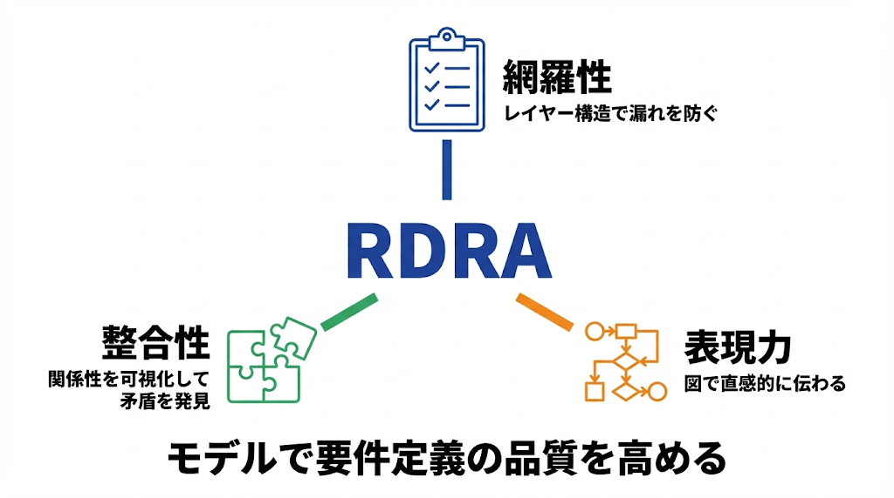
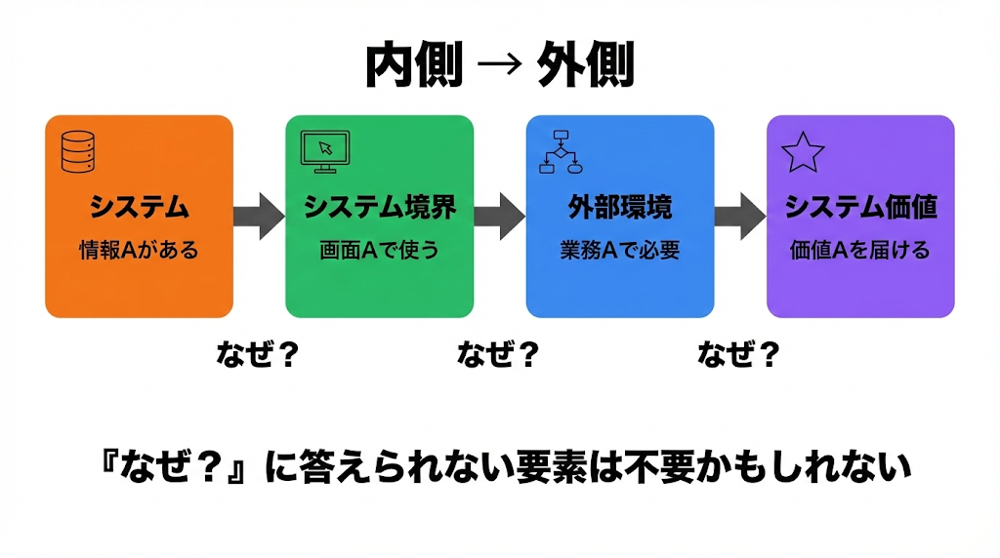
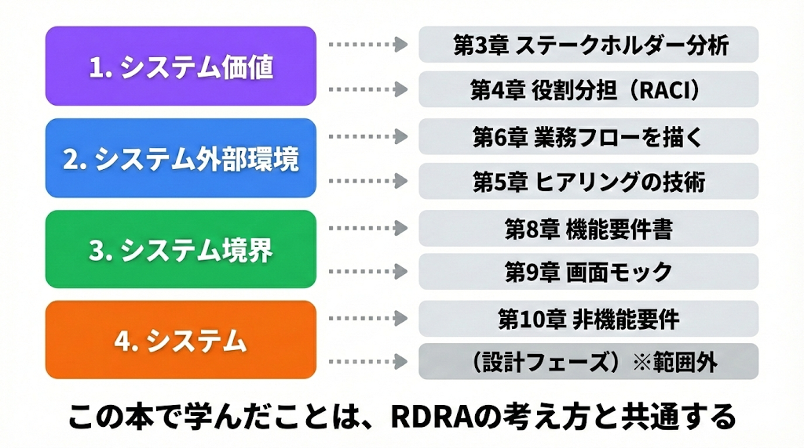

# RDRA フレームワーク

出典: 「要件定義の教科書」（tan_go238）第6部

## RDRA とは

RDRA（Relationship Driven Requirement Analysis / リレーションシップ駆動要件分析）は、神崎善司氏が開発した日本発のモデルベース要件定義手法。

要件をリストで並べるのではなく、要素間の**関係性（リレーションシップ）**を可視化することで、漏れや矛盾のない要件定義を目指す。



## RDRA が解決する問題

| 従来の課題 | RDRA のアプローチ |
|-----------|----------------|
| 分量が多く中身が薄い要件定義書 | モデルで本質を簡潔に表現 |
| 何が決まっていて何が決まっていないか不明 | 図にすると空白が見える |
| 要件間のつながりが見えない | 関係性を線でつなぐ |
| 空中戦ばかりで何も決まらない | 図を見ながら議論できる |
| 作った機能が使われない | 「なぜ必要か」をたどれる |

RDRAは「読む」より「見る」要件定義。関係者が集まって、図を見ながらその場で決めていける。

## RDRA の4つのレイヤー



| レイヤー | 視点 | 明らかにすること |
|---------|------|--------------|
| システム価値 | なぜ作るのか | 誰に、どんな価値を提供するか |
| システム外部環境 | どんな状況で使うのか | 業務フロー、ビジネスルール |
| システム境界 | 何を入出力するのか | 画面、帳票、外部システム連携 |
| システム | 何を管理するのか | 情報（データ）、状態 |

外側から内側に向かって詳細化していく。レイヤー間に「なぜ？」の依存関係がある。

## 「なぜ？」でつながる要件

内側のレイヤーから外側に向かって「なぜ？」と問いかけると、その要素が必要な理由がわかる。

```
情報Aがある → 画面Aで使う → 業務Aで必要 → 価値Aを届ける
    ↑ なぜ？      ↑ なぜ？      ↑ なぜ？
```

- 「なぜ？」に答えられない要素は不要かもしれない
- 上位の価値とつながっていない機能は「作ったけど使われない機能」になる危険信号

## RDRA の主なダイアグラム



| レイヤー | 主なダイアグラム | 対応する活動 |
|---------|--------------|-----------|
| システム価値 | システムコンテキスト図、要求モデル | ステークホルダー分析 |
| システム外部環境 | 業務フロー図、ビジネスユースケース図 | 業務フローを描く |
| システム境界 | ユースケース複合図、画面・帳票一覧 | 機能要件、画面モック |
| システム | 情報モデル、状態モデル | （設計フェーズで詳細化） |

## As-Is 分析にも使える

RDRAは新規開発（To-Be）だけでなく、既存システムの分析にも使える。

| 用途 | 進め方 | 目的 |
|------|--------|------|
| 新規開発（To-Be） | 外側（価値）から内側（システム）へ | 要件を決める |
| 既存分析（As-Is） | 内側（システム）から外側（価値）へ | 現状を可視化する |

既存システムの場合は逆にたどる。画面や機能から「これは何のためにあるのか？」をたどると、誰も使っていない機能や目的が不明な処理が見えてくる。ドキュメントがない既存システムの可視化にも有効。

## RDRA を始めるには

### 学習リソース

| リソース | 内容 |
|---------|------|
| 公式サイト（https://www.rdra.jp/） | 手法の解説、サンプル、ツール |
| 『RDRA2.0ハンドブック』 | 電子書籍。基本的な考え方とやり方 |
| 『モデルベース要件定義テクニック』 | 書籍。より詳しい解説 |

### ツール

| ツール | 特徴 |
|--------|------|
| PowerPoint | 手軽に始められる。アイコンセットあり |
| Googleスプレッドシート | 表形式で素早く定義できる |
| RDRAGraphツール | ビジュアルに関係性を表現 |

まずは小さなプロジェクトで、システムコンテキスト図と業務フロー図から始めるのがおすすめ。

## メリットと注意点

### メリット

| メリット | 説明 |
|---------|------|
| 網羅性 | レイヤー構造で漏れを防ぐ |
| 整合性 | 関係性を可視化して矛盾を発見 |
| 表現力 | 図で直感的に伝わる |
| コミュニケーション促進 | 関係者で図を見ながら議論できる |
| トレーサビリティ | 「なぜこの機能があるか」をたどれる |

### 注意点

| 注意点 | 対処法 |
|--------|--------|
| 学習コストがある | まずは一部のダイアグラムから始める |
| 図を描くのに時間がかかる | 完璧を目指さず、議論のたたき台として使う |
| チーム全員が理解する必要がある | 勉強会を開く、簡単な説明資料を用意 |

RDRAの考え方——レイヤーで整理する、関係性を可視化する、「なぜ？」でつなげる——は、フレームワークを使わなくても意識できる。
