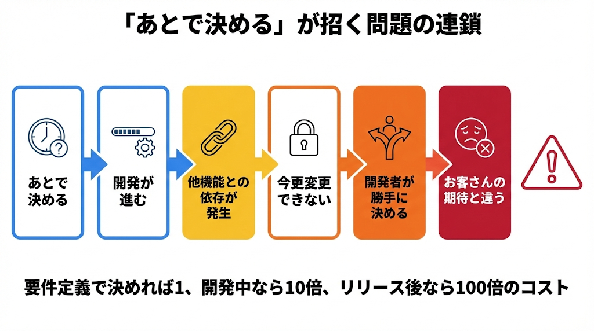
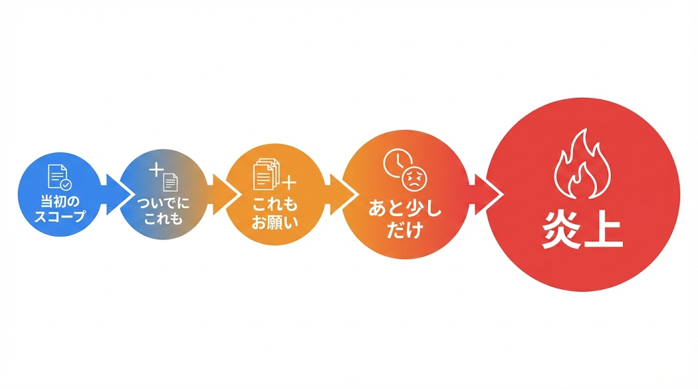
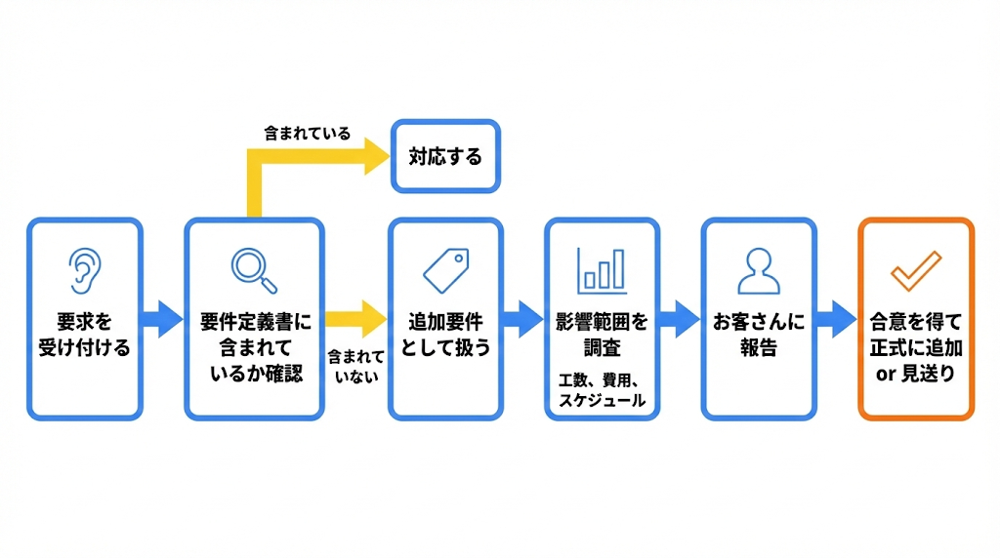
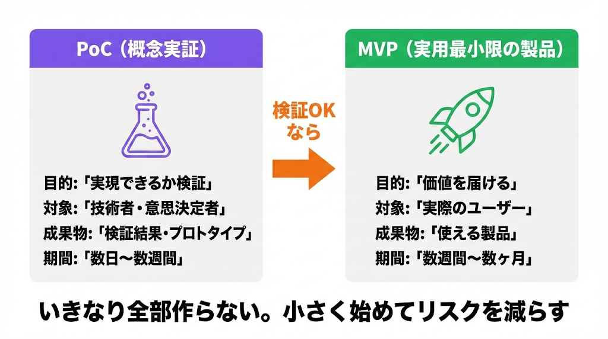
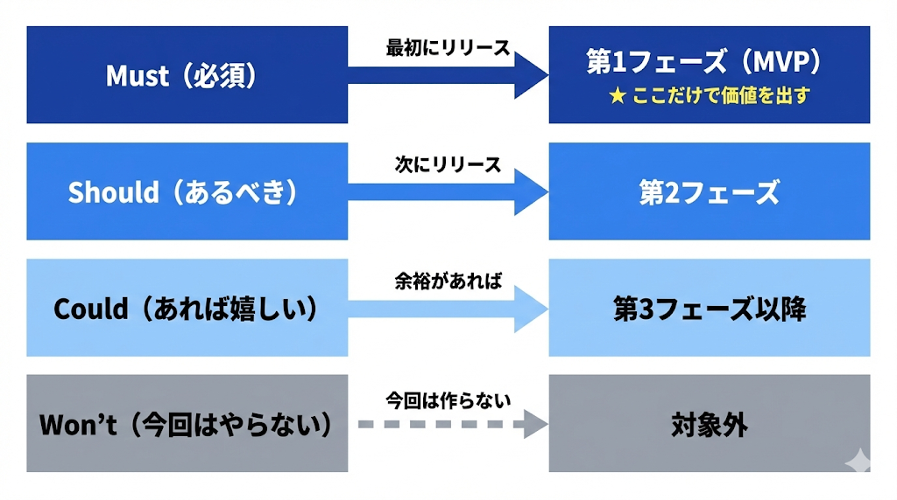

# トラブルを防ぐ

出典: 「要件定義の教科書」（tan_go238）第4部

## 「あとで決めましょう」の罠

### 「あとで」が危険な理由

- 開発開始後は、決めている余裕がない
- 他の機能との整合性が取れなくなる
- 後から決めると、手戻りが発生する
- 結局決まらず、開発者が勝手に決める → お客さんの期待と違う結果になる

### 決められない人に決めてもらう技術

決められない理由は3つに分けられる:

| 理由 | 対処法 |
|------|--------|
| 情報が足りない | 選択肢と影響を整理して見せる |
| 権限がない | 決裁者を巻き込む |
| リスクが怖い | 最悪ケースと対策を説明する |

### 決断を促すテクニック

| テクニック | やり方 |
|----------|--------|
| 選択肢を絞る | 「A・B・Cの3案があります。どれにしますか？」 |
| デフォルトを提示 | 「特にご指定なければAで進めますが、よいですか？」 |
| 期限を切る | 「○日までに決めていただければ、予定通り進められます」 |
| リスクを伝える | 「決まらない場合、この部分の開発が止まります」 |
| 仮決定にする | 「一旦Aで進めて、○○の時点で見直しましょう」 |

仮決定は「いつ見直すか」を明確にしておくこと。「いつか見直す」だと結局見直されない。

### 未決事項の管理

どうしても決まらない場合はリスク管理として未決事項を記録する:

- 何が決まっていないか
- いつまでに決める必要があるか
- 誰が決めるか
- 決まらなかった場合のリスク
- 仮の前提（あれば）

「この項目が○日までに決まらないと、リリースが2週間遅れます」と事実を伝える。

## スコープクリープとの戦い

### スコープクリープとは

プロジェクトの範囲（スコープ）が少しずつ拡大していく現象。「ついでにこれも」「これくらいなら」の積み重ねで、いつの間にか工数も予算もオーバーする。

スコープが広がると品質が下がるか、納期が遅れるか、予算が増えるか、どれかにしわ寄せが来る。

### スコープクリープが起きる原因

- 要件定義が曖昧で、「含まれている」と解釈される
- 断れない雰囲気で、小さな追加を受け入れ続ける
- 変更管理のルールが決まっていない
- お客さんが「要件定義後は変更できない」を理解していない

### 追加要件の対応フロー

1. 要求を受け付ける（まずは聞く）
2. 要件定義書に含まれているか確認
3. 含まれていなければ「追加要件」として扱う
4. 影響範囲を調査（工数、費用、スケジュール）
5. お客さんに報告し、対応方針を決める
6. 合意を得て、正式に要件に追加（または見送り）

小さい変更こそ危ない。ルールを決めたら例外を作らない。

### 「No」の伝え方

断るのではなく「条件を提示する」。僕らの仕事は「影響を正確に伝える」こと。判断するのはお客さんの仕事。

| フレーズ | 使う場面 |
|---------|---------|
| 「できます。ただし、○○が必要です」 | 追加コスト・期間を提示 |
| 「この機能を削れば、入れ替えで対応できます」 | トレードオフを提示 |
| 「第2フェーズで対応するのはいかがですか？」 | 時期をずらす提案 |
| 「簡易版なら今回のスコープで対応できます」 | スコープを絞る提案 |

## フェーズを分けて対応する

### MVP: Minimum Viable Product（実用最小限の製品）

「最小限」だけど「使える」ことが重要。「機能が少ない」ではなく「コア機能に絞る」。

### PoC: Proof of Concept（概念実証）

「そもそも、これって実現できるの？」を検証すること。

| 項目 | PoC | MVP |
|------|-----|-----|
| 目的 | 実現可能性の検証 | 価値の提供・検証 |
| 対象 | 技術者・意思決定者 | 実際のユーザー |
| 成果物 | 検証結果・プロトタイプ | 使える製品 |
| 期間 | 数週間〜1ヶ月程度 | 数ヶ月 |
| 次のステップ | 本格開発に進むか判断 | フィードバックを得て改善 |

### フェーズ分けのメリット

| メリット | 説明 |
|---------|------|
| 早くリリースできる | 必要最低限の機能で先に価値を届けられる |
| リスクが減る | 小さく作って検証できる |
| フィードバックを活かせる | 第1フェーズの反応を見て、第2フェーズを調整できる |
| 予算を分散できる | 一度に大きな投資をしなくて済む |
| 追加要件の受け皿になる | 「今回は難しいけど、次のフェーズで」と言える |

### フェーズ分けの例（経費精算システム）

| フェーズ | 内容 | 期間 |
|---------|------|------|
| （PoC） | AI-OCRでレシート読み取りの精度検証 | 2週間 |
| 第1フェーズ（MVP） | 基本の申請・承認機能 | 3ヶ月 |
| 第2フェーズ | レポート・分析機能 | 2ヶ月 |
| 第3フェーズ | 会計システム連携 | 2ヶ月 |

### フェーズ分けの注意点

| 注意点 | 説明 |
|--------|------|
| 第1フェーズ（MVP）だけで価値を出す | 「第2フェーズがないと使えない」はMVPじゃない |
| 依存関係を考慮する | 後のフェーズに必要な基盤は先に作っておく |
| 「第2フェーズで」を乱用しない | 何でも先送りすると信頼を失う |
| フェーズ間の移行を計画する | データ移行やユーザー教育も考慮 |
| PoCの結果を正直に報告する | 都合の悪い結果も隠さない |

## 優先順位をつける

### MoSCoW 法

| 分類 | 意味 | 説明 | 割合の目安 |
|------|------|------|----------|
| Must | なければ成り立たない | これがないとシステムの意味がない | 〜60% |
| Should | あるべき | ないと困るが、なくても最低限は動く | 〜20% |
| Could | あれば嬉しい | あると嬉しいが、なくても許容範囲 | 〜20% |
| Won't | 今回はやらない | 将来的には欲しいが、今回は対象外 | - |

「Mustは全体の6割まで」のように制約をつけることで、強制的に優先順位をつけさせる。「全部必須」は「優先順位がついていない」と同じ。

### MoSCoW とフェーズの対応

| MoSCoW | フェーズ | 説明 |
|--------|---------|------|
| Must | 第1フェーズ（MVP） | 最初にリリース。これだけで価値を出す |
| Should | 第2フェーズ | 次にリリース。使い勝手が向上する |
| Could | 第3フェーズ以降 | 余裕があれば対応 |
| Won't | 対象外 | 今回のプロジェクトでは作らない |

### トレードオフを見える化する

「全部Must！」と譲らない場合は、トレードオフを数字で見せる。

| 選択A | 選択B | 解説 |
|-------|-------|------|
| 機能を増やす | 開発期間が延びる | 機能と期間のトレードオフ |
| 品質を上げる | コストが増える | 品質とコストのトレードオフ |
| 早くリリースする | 機能を絞る | 速度とスコープのトレードオフ |

「この機能を追加すると、2週間遅れます。それでもいいですか？」と具体的に聞くと、判断してくれる。

### 優先順位を決めるワークショップ

ステークホルダーを集めたワークショップで決めるのが理想。

**理由**:
- 部署間の利害を調整できる
- 決定の背景が共有される
- 「自分たちで決めた」という納得感（コミットメント）が得られる

**やり方（例）**:
1. 機能一覧を壁に貼り出す（付箋がおすすめ）
2. 各機能の説明と、想定工数を共有
3. 参加者に「Must」「Should」「Could」「Won't」の札を配る
4. 一斉に投票してもらう
5. 意見が分かれた機能について議論
6. 最終的な優先順位を合意

### スコープクリープ vs 正式な変更

| パターン | 説明 |
|---------|------|
| スコープクリープ | なし崩し的に範囲が広がる。合意がない |
| 正式な変更 | 影響を評価し、ステークホルダーの合意を得て変更する |

優先順位を見直すのは正常なこと。問題は、こっそり変わっていくこと。変えるなら合意を取る。
