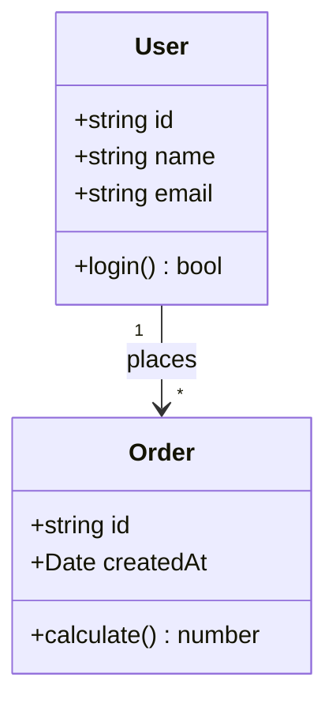
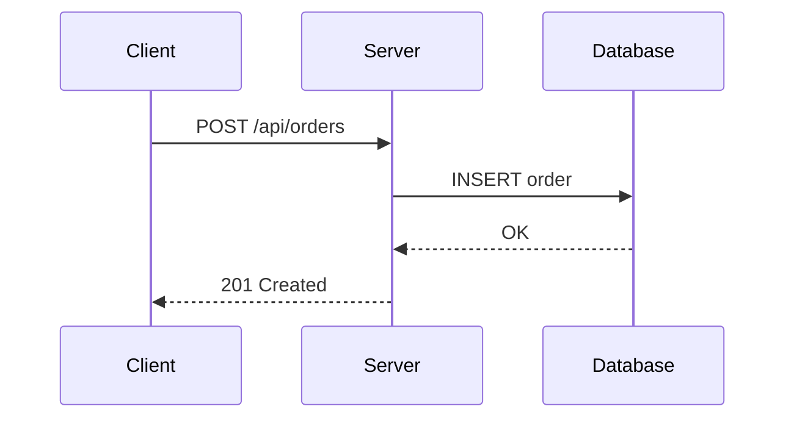
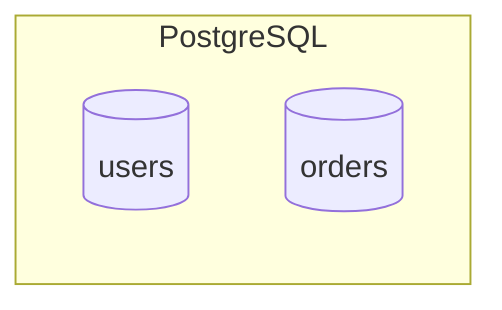

# UML設計 Skill

Mermaid記法でのUMLダイアグラム作成規約。UML 2.x の一般知識は省略する。

## 出力規約

すべての UML ダイアグラムは **Mermaid 記法** で出力する（Markdown 内で描画可能）。

### クラス図の例

### シーケンス図の例

## 設計パターン

- GoF デザインパターンをUMLで表現する際、ステレオタイプ（`<<Strategy>>` 等）で明示する

## ドメインモデリング

- ユビキタス言語をクラス名・属性名に使用する
- 集約境界を明示する
- 値オブジェクトとエンティティを区別する

## GitHub 互換 Mermaid 構文ルール

GitHub の Mermaid レンダラーで正しく表示するために、以下のルールを守る。

### subgraph のタイトルに特殊記法を使わない

subgraph はグループの識別子と表示名を定義する場所であり、ノード形状記法を含めるとパーサーが停止する。

- ❌ `subgraph DB[(PostgreSQL)]` — 円柱形 `[( )]` がパースエラーになる
- ✅ `subgraph DB["PostgreSQL"]` — 表示名は `""` で囲む

DB アイコン（円柱形）を表現したい場合は、subgraph 内の個別ノードに適用する:

### ノード形状記法の一覧（subgraph タイトルでは使用不可）

| 記法 | 形状 | 使用可能な場所 |
|------|------|--------------|
| `[( )]` | 円柱形（DB） | ノード定義のみ |
| `[[ ]]` | サブルーチン | ノード定義のみ |
| `(( ))` | 円形 | ノード定義のみ |
| `{ }` | ひし形 | ノード定義のみ |
| `[/ /]` | 平行四辺形 | ノード定義のみ |

## 推薦書籍

- [『かんたん UML入門 [改訂2版]』](https://amzn.asia/d/08sNkxrz)
