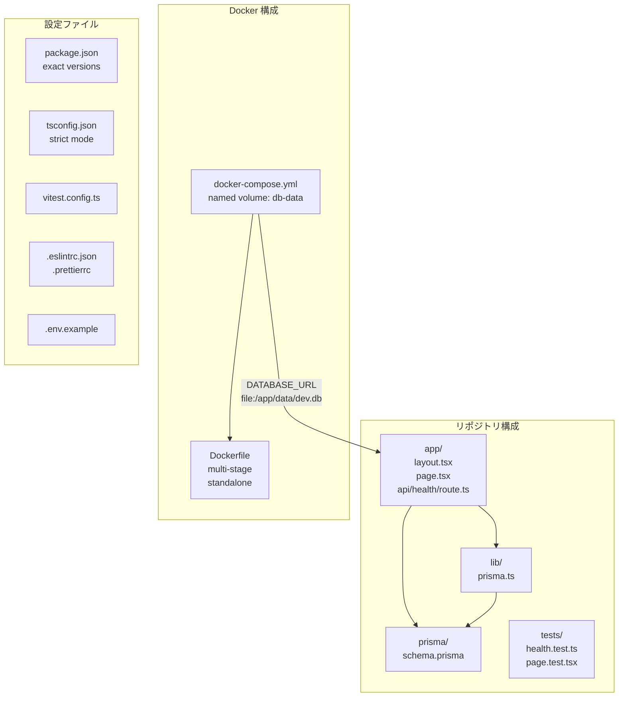

# Changes — Issue #7 React + Next.js + SQLite 環境構築（Docker 定義）

- date: 2026-06-29
- branch: feature/7-env-setup
- issue: https://github.com/kit-kamatsu-yuhi/todo-app/issues/7

## 変更の全体像

## 変更ファイル一覧

### 新規作成

| ファイル | 内容 |
|---------|------|
| `app/layout.tsx` | Next.js App Router 共通レイアウト（html/body） |
| `app/page.tsx` | トップページ（React Server Component、h1: todo-app） |
| `app/api/health/route.ts` | ヘルスチェック API（Node ランタイム、Prisma SELECT 1） |
| `lib/prisma.ts` | PrismaClient シングルトン（HMR 対応） |
| `prisma/schema.prisma` | Prisma 設定（sqlite datasource + generator のみ、モデルは #8） |
| `tests/health.test.ts` | /api/health ユニットテスト（成功 200 + 失敗 503） |
| `tests/page.test.tsx` | トップページ render テスト |
| `Dockerfile` | multi-stage build（base/deps/builder/runner） |
| `docker-compose.yml` | named volume db-data で SQLite 永続化 |
| `.dockerignore` | Docker ビルドコンテキスト除外設定 |
| `.env.example` | DATABASE_URL サンプル |
| `package.json` | Next.js 15.5.19 + Prisma 6.19.3 + vitest（exact versions） |
| `tsconfig.json` | strict モード |
| `next.config.ts` | standalone 出力設定 |
| `vitest.config.ts` | vitest + @testing-library/react + jsdom |
| `.eslintrc.json` | ESLint（eslint-config-next） |
| `.prettierrc` | Prettier 設定 |
| `README.md` | 起動・テスト手順 |
| `raw/conversations/2026-06-29_issue-7-env-setup.md` | 技術選定・判断事項のコンテキスト |

### 変更

| ファイル | 変更内容 |
|---------|---------|
| `.gitignore` | node_modules / .next / *.db / .env 等を追記 |

## 主要な実装の解説

### GET /api/health（`app/api/health/route.ts`）

Prisma の `$queryRaw\`SELECT 1\`` でDBへの疎通を確認する。成功時は `{ status: "ok", db: "ok" }` を 200 で返し、失敗時は `{ status: "error" }` を 503 で返す。`runtime = "nodejs"` の明示は SQLite/Prisma が Edge Runtime で動作しないため必須。`dynamic = "force-dynamic"` でキャッシュを無効化し、毎リクエストごとに実際の DB 接続を確認する。

### PrismaClient シングルトン（`lib/prisma.ts`）

Next.js の HMR（Hot Module Replacement）では同じモジュールが複数回読み込まれ、`new PrismaClient()` が多重呼び出しになる。`globalThis` にインスタンスをキャッシュすることで開発環境での接続数増加を防ぐ。本番環境では HMR が発生しないためキャッシュは不要。

### Docker 構成（`Dockerfile` + `docker-compose.yml`）

Dockerfile は 4 ステージ構成（base / deps / builder / runner）で、runner ステージは `next start` のみ含む slim イメージ。`output: "standalone"` により必要最小限のファイルのみ含まれる。SQLite ファイルを named volume `db-data` の `/app/data/` に置くことでコンテナ再起動後もデータが保持される。`runner` は非 root ユーザー（nextjs:nodejs, uid=1001）で実行する。

#7 スコープでは Prisma モデルが存在しないため、起動時の `prisma migrate deploy` は不要。SQLite ファイルは Prisma Client の初回接続時に自動生成される。#8 でモデルを追加した際に compose の command に `prisma migrate deploy` を追加する。

### テスト（`tests/health.test.ts`）

実 DB に依存しないよう `vi.mock("@/lib/prisma")` で Prisma クライアントをモックする。`beforeEach` で成功状態にリセットし、テストの独立性を保つ。DB 接続失敗時の 503 パスは `mockRejectedValueOnce` で注入して検証する。

## 受入基準の充足状況

| 受入基準 | 状態 | 根拠 |
|---------|------|------|
| docker compose up で起動・GET /api/health が 200 | GREEN | 実機検証済み（`{"status":"ok","db":"ok"}`） |
| コンテナ再起動後も DB ファイルがボリュームに残り再接続できる | GREEN | 実機で再起動後の health 200 継続を確認 |
| npm test でサンプルテスト green | GREEN | 3/3 passed（health×2 + page×1） |
| トップページが React で表示される | GREEN | 実機で `<h1>todo-app</h1>` 描画を確認 |
