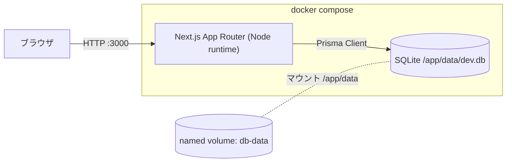

# Issue #7 実装計画: React + Next.js + SQLite 環境構築（Docker 定義）

- url: https://github.com/kit-kamatsu-yuhi/todo-app/issues/7
- branch: feature/7-env-setup
- 種別: 新規プロジェクトの scaffolding（後続 #8 Prisma スキーマの土台）

## 1. 要件分析

### 機能要件
- `docker compose up` 一発で Next.js アプリが起動する
- `GET /api/health` が 200（JSON: `{ "status": "ok" }`）を返す
- `GET /`（トップページ）が React で描画される
- SQLite を Prisma 経由で読み書きでき、コンテナ再起動後もデータが残る
- `npm test`（vitest）でサンプルテストが 1 件以上 green

### 非機能要件
- 開発がコンテナ内で完結（ローカルに Node なしでも起動）
- Next.js は **Node ランタイム**で動かす（SQLite/Prisma のため Edge 不可）
- ESLint / Prettier による lint・format
- README に起動・テスト手順

### 受入基準の分類
| 受入基準 | 種別 |
|---|---|
| docker compose up で起動・`GET /api/health` が 200 | 手動（起動確認）+ 自動（route のテスト） |
| コンテナ再起動後も SQLite の DB ファイルがボリュームに残り再接続できる（テーブル書込→読出の完全検証は #8） | 手動（compose 再起動して確認） |
| `npm test` でサンプルテスト green | 自動 |
| トップページで React ページ表示 | 手動（ブラウザ）+ 自動（render テスト） |

## 2. アーキテクチャ構成



## 3. ディレクトリ構成（予定）

```
.
├─ app/
│  ├─ layout.tsx
│  ├─ page.tsx                 # トップページ（React 最小）
│  └─ api/health/route.ts      # GET /api/health
├─ lib/
│  └─ prisma.ts                # PrismaClient シングルトン
├─ prisma/
│  ├─ schema.prisma            # datasource(sqlite) + generator + 最小モデル
│  └─ migrations/              # prisma migrate 生成物
├─ tests/
│  ├─ health.test.ts           # /api/health の自動テスト
│  └─ page.test.tsx            # トップページ render テスト
├─ Dockerfile
├─ docker-compose.yml
├─ .dockerignore
├─ .env.example                # DATABASE_URL 等のサンプル
├─ package.json / tsconfig.json / next.config.ts
├─ .eslintrc / .prettierrc
└─ README.md
```

## 4. API 設計

| メソッド | パス | 説明 | レスポンス |
|---|---|---|---|
| GET | `/api/health` | ヘルスチェック。DB 接続も確認（`SELECT 1`） | 200 `{ "status": "ok", "db": "ok" }` / 503 `{ "status": "error" }` |
| GET | `/` | トップページ（React） | HTML |

- `/api/health` は Route Handler（`app/api/health/route.ts`）。`export const runtime = 'nodejs'` を明示。

## 5. DB 設計

- Prisma datasource: `provider = "sqlite"`, `url = env("DATABASE_URL")`
- `DATABASE_URL="file:/app/data/dev.db"`（named volume `db-data` を `/app/data` にマウントして永続化）
- **本 Issue のスコープ（承認で確定）**: 業務テーブル（User/Todo 等）と初回マイグレーションは **#8 に回す**。#7 では Prisma の接続確立のみを扱う:
  - `prisma/schema.prisma` は datasource(sqlite) + generator(client) のみ（モデルなし）
  - `prisma generate` で Client 生成。初回接続時に DB ファイルが `/app/data/dev.db` に作成される
  - `/api/health` が `prisma.$queryRaw` の `SELECT 1` で接続を確認
- 「再起動後もデータ保持」の検証は #7 では **DB ファイルがボリューム上に残り再接続できる**ことまで。テーブルへの書き込み→再起動→読み出しの完全な round-trip は #8 で実施
  - ※ GitHub Issue #7 の受入基準文（"データが保持されている"）はこの解釈に合わせる。文言を厳密に直したい場合は issue 側を編集（外向き操作のため実行は依頼者側で）

## 6. フロントエンド設計

- `app/page.tsx`: 「todo-app」見出し + 稼働確認用の最小コンポーネント（Server Component で可）
- `app/layout.tsx`: 共通レイアウト（html/body）
- 状態管理・ルーティングは本 Issue では最小（scaffolding のため）

## 7. セキュリティ基準

- secret はリポジトリに置かない。`.env` は gitignore 済み、`.env.example` のみ追跡
- gitleaks pre-commit が稼働中（`.gitleaks.toml` 設定済み）
- `DATABASE_URL` は環境変数で注入（compose の env / `.env`）
- 本 Issue では認証なし（認証は #9）

## 8. ロギング要件

- 起動ログ（Next.js 標準）
- `/api/health` の DB 接続失敗時は ERROR ログ + 503 を返す
- 機密情報はログに出さない（`DATABASE_URL` をそのまま出力しない）

## 9. テスト戦略

- フレームワーク: **vitest**（+ @testing-library/react for component）
- Unit/Integration:
  - `tests/health.test.ts`: `/api/health` ハンドラを呼び 200 と `status: ok` を検証
  - `tests/page.test.tsx`: トップページが見出しを render することを検証
- 手動: `docker compose up` 起動確認、再起動後の SQLite データ保持
- カバレッジ目標は scaffolding のため厳密には課さない（後続 Issue で 80% を目指す）

## 10. タスク分解

→ `todos.md` 参照（1 タスク 2h 以内に分解済み）

## 11. リスク分析と対策

| リスク | 影響 | 確率 | 対策 |
|---|---|---|---|
| Next.js + SQLite の永続化先がボリュール外でデータ消失 | 高 | 中 | `DATABASE_URL` を named volume 配下（`/app/data`）に固定。再起動テストで検証 |
| Prisma migrate がコンテナ初回起動で未適用 | 中 | 中 | compose の起動コマンドで `prisma migrate deploy` を実行してから `next` 起動 |
| Edge ランタイムに載って Prisma が動かない | 中 | 低 | route に `runtime = 'nodejs'` 明示、build 確認 |
| Docker イメージが重く起動が遅い | 低 | 中 | multi-stage build、`.dockerignore` で node_modules 等を除外 |
| vitest と Next.js(App Router) の設定衝突 | 中 | 中 | vitest 設定に `vite-tsconfig-paths` 等を導入、最小テストで疎通確認 |

## 確認結果（承認済み）
1. 最小モデル `HealthCheck` は **入れない**。#7 は Prisma 接続確認（`SELECT 1`）まで。データ保持の完全検証は #8。
2. パッケージマネージャは **npm**。
3. Phase B 実装に進むことを承認済み。

## 実行フロー

1. ✅ `/plan-issue` — 計画策定（完了）
2. ⬜ ユーザー承認 — plan.md + todos.md の内容を確認してもらう
3. ⬜ `/codex-team all` — 実装/テスト/レビュー（codex sub-agent チームで実行）
   - codex-implement + codex-test: 実装・テスト（Agent ツールで並列起動）
   - codex-review + review-agent: レビュー（Agent ツールで並列起動）
   - acceptance-criteria-agent: 受入基準 RED/GREEN 判定
4. ⬜ `/create-pr` — PR 作成（/walkthrough → changes.md → PR）
