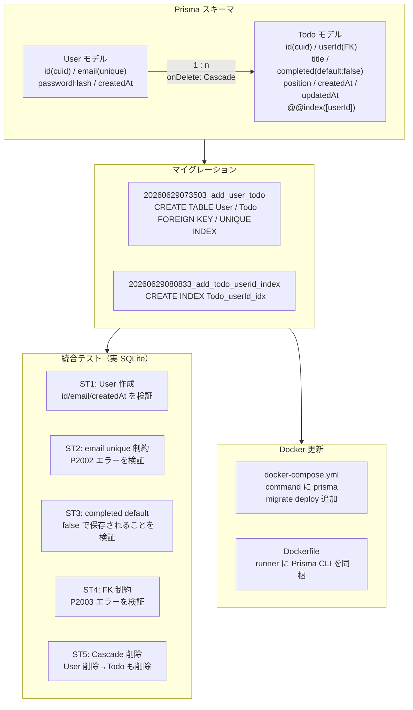

# Changes — Issue #8 User / Todo テーブル作成

- date: 2026-06-29
- branch: feature/8-schema
- issue: https://github.com/kit-kamatsu-yuhi/todo-app/issues/8

## 変更の全体像

## 変更ファイル一覧

### 新規作成

| ファイル | 内容 |
|---------|------|
| `prisma/migrations/20260629073503_add_user_todo/migration.sql` | User/Todo テーブル作成・制約・インデックス |
| `prisma/migrations/20260629080833_add_todo_userid_index/migration.sql` | Todo.userId インデックス追加 |
| `prisma/migrations/migration_lock.toml` | マイグレーションロック |
| `tests/schema.test.ts` | User/Todo スキーマ統合テスト（ST1〜ST5） |
| `tests/helpers/db.ts` | テスト用 PrismaClient ヘルパー |
| `raw/issues/2026-06-29_8/plan.md` | 実装計画 |
| `raw/issues/2026-06-29_8/todos.md` | タスクリスト |

### 変更

| ファイル | 変更内容 |
|---------|---------|
| `prisma/schema.prisma` | User / Todo モデルを追加、`@@index([userId])` を定義 |
| `docker-compose.yml` | `command` に `prisma migrate deploy` を追加 |
| `Dockerfile` | runner ステージに Prisma CLI（`node_modules/prisma`, `@prisma`）をコピー |
| `vitest.config.ts` | `pool: "forks"` + `singleFork: true` を追加（DB 統合テストの並列競合防止） |

## 主要な実装の解説

### Prisma スキーマ（`prisma/schema.prisma`）

`User` と `Todo` の 2 モデルを追加。`id` には `@default(cuid())` を使い衝突しにくい識別子を生成する。`Todo.completed` は `@default(false)` でデフォルト値を保証し、`updatedAt` は `@updatedAt` で Prisma が自動更新する。

`onDelete: Cascade` を選択した理由: ユーザー削除時に孤立した Todo が残るのを防ぐ。`Restrict`（デフォルト）では Todo を持つユーザーを削除できず UX を損なう。

`@@index([userId])` を明示的に定義した理由: SQLite では Prisma が FK カラムに自動インデックスを生成しないため。Todo 一覧取得（`WHERE userId = ?`）が最頻クエリになることから必須。

### テスト設計（`tests/schema.test.ts` + `tests/helpers/db.ts`）

実 SQLite（`test.db`）を使う統合テストとして実装。モックでは検証できないスキーマ制約（unique/FK/default/cascade）をすべて網羅する。

`helpers/db.ts` は `testPrisma` の URL を `datasources` オプションで `test.db` に向け、`process.env` を書き換えない設計にして他テストへの副作用を排除した。`setupTestDb()` は `beforeAll` で呼び出し、クリーン環境でも必ずマイグレーションが適用されることを保証する。

### Docker 更新

`docker-compose.yml` の `command` に `prisma migrate deploy && node server.js` を追加し、コンテナ起動時に未適用マイグレーションが自動適用される。`Dockerfile` の runner ステージに `prisma` CLI と生成物（`@prisma/client`）を同梱することで standalone ビルドでも実行可能にした。

## 受入基準の充足状況

| 受入基準 | 状態 | 根拠 |
|---------|------|------|
| migrate 実行後に User/Todo が定義通り存在する | GREEN | ST1 で User 生成・フィールド検証済み |
| 存在しない userId で Todo 作成 → FK 制約エラー | GREEN | ST4 で P2003 コード確認済み |
| 同一 email の登録 → unique 制約エラー | GREEN | ST2 で P2002 コード確認済み |
| completed 未指定で Todo 作成 → default(false) | GREEN | ST3 で false 値を確認済み |
