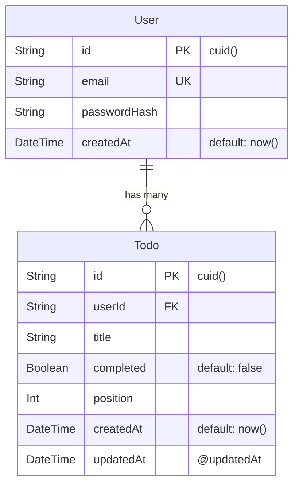

# Issue #8 実装計画: User / Todo テーブル作成

- url: https://github.com/kit-kamatsu-yuhi/todo-app/issues/8
- branch: feature/8-schema
- 種別: Prisma スキーマ定義 + マイグレーション（#7 の土台の上に業務モデルを追加）

## 1. 要件分析

### 機能要件

- `User` モデル: `id`(cuid), `email`(unique), `passwordHash`, `createdAt`
- `Todo` モデル: `id`(cuid), `userId`(FK→User), `title`, `completed`(default false), `position`(Int, 並び順), `createdAt`, `updatedAt`
- User 1 - n Todo リレーション（onDelete: Cascade — ユーザー削除時に紐づく Todo も削除）
- `prisma migrate dev` でマイグレーションファイルを生成し、`prisma migrate deploy` で適用
- スキーマに対する最小の自動テスト（生成・unique 制約・relation 制約・default 値）

### 非機能要件

- `passwordHash` は平文パスワードを格納しない（ハッシュ値のみ。ハッシュ処理は #9）
- マイグレーションファイルをリポジトリで管理し再現可能にする
- テストは実 SQLite（test.db）を使う統合テスト。モックなし
- Docker compose の起動前コマンドに `prisma migrate deploy` を追加

### 受入基準の分類

| 受入基準 | 種別 |
|---|---|
| migrate 実行後に User/Todo が定義通り存在する | 自動（integration） |
| 存在しない userId で Todo 作成 → FK 制約エラー | 自動（integration） |
| 同一 email の登録 → unique 制約エラー | 自動（integration） |
| completed 未指定で Todo 作成 → default(false) | 自動（integration） |

## 2. DB 設計

### ER 図



### Prisma スキーマ設計

```prisma
model User {
  id           String   @id @default(cuid())
  email        String   @unique
  passwordHash String
  createdAt    DateTime @default(now())
  todos        Todo[]
}

model Todo {
  id        String   @id @default(cuid())
  userId    String
  user      User     @relation(fields: [userId], references: [id], onDelete: Cascade)
  title     String
  completed Boolean  @default(false)
  position  Int
  createdAt DateTime @default(now())
  updatedAt DateTime @updatedAt
}
```

### インデックス設計

- `User.email`: `@unique` で自動インデックス（ログイン検索用）
- `Todo.userId`: Prisma が FK に自動インデックスを付与
- `Todo` の `(userId, position)` 複合インデックス: 同一ユーザーの Todo を並び順で取得する際に有効（#10 以降で追加を検討、今 Issue では不要）

### onDelete の選択根拠

`Cascade` を採用。ユーザー削除時に孤立した Todo レコードが残るのを防ぐ。`Restrict`（デフォルト）では Todo を持つユーザーが削除できず UX を損なう。#9 以降の要件で変更が必要な場合は migrate で対応可能。

## 3. API 設計

本 Issue は DB スキーマ層のみ。API エンドポイントは #9（認証）・#10（Todo CRUD）以降。

ただし `/api/health` の動作確認（SELECT 1）は引き続き機能すること。

## 4. セキュリティ基準

- `passwordHash` フィールド名を明示し、平文パスワードを保存しない設計を型で強制（文字列型で受け取るが、呼び出し側でハッシュ化が必要と README に明記）
- テスト用 DB（`test.db`）は `.gitignore` に追加済み（`*.db` で除外）
- マイグレーションファイル（`prisma/migrations/`）はリポジトリに含める（スキーマ変更の履歴管理のため）

## 5. テスト戦略

### テスト種別: Integration テスト（実 SQLite）

ユニットテストでのモックではスキーマ制約（unique / FK / default）を検証できないため、実 SQLite ファイルを使う統合テストとする。

### テスト用 DB 設定

- `DATABASE_URL=file:./prisma/test.db`（テスト専用 DB）
- `vitest.config.ts` に `setupFiles` で `prisma migrate deploy` を実行し、テスト DB を最新スキーマにする
- 各テストの前後で Prisma `deleteMany` によりデータをクリーンアップ

### テストケース（`tests/schema.test.ts`）

| No. | テスト内容 | 受入基準 |
|---|---|---|
| ST1 | User を作成して id / email / createdAt が返る | migrate 後に User が定義通り |
| ST2 | 同一 email で2回 User 作成 → unique エラー | unique 制約 |
| ST3 | User に紐づく Todo を作成して completed が false | default(false) |
| ST4 | 存在しない userId で Todo 作成 → FK エラー | relation 制約 |
| ST5 | User 削除時に紐づく Todo も削除される（Cascade） | onDelete: Cascade |

### 既存テストへの影響

`tests/health.test.ts` と `tests/page.test.tsx` はモックを使うため影響なし。

## 6. Docker 更新

`docker-compose.yml` の `command` に `prisma migrate deploy` を追加：

```yaml
command: sh -c "npx prisma migrate deploy && node server.js"
```

`Dockerfile` の runner ステージに Prisma CLI の実行に必要な `schema.prisma` と `migrations/` をコピー済みであることを確認（#7 の Dockerfile で `COPY --from=builder /app/prisma ./prisma` が含まれていること）。

## 7. ロギング要件

- マイグレーション適用ログ（`prisma migrate deploy` の標準出力）: INFO レベル
- テスト用 DB 作成・クリーンアップのエラー: ERROR レベル
- `passwordHash` はログに出力しない

## 8. タスク分解

→ `todos.md` 参照

## 9. リスク分析

| リスク | 影響 | 確率 | 対策 |
|---|---|---|---|
| SQLite の FK 制約がデフォルト無効 | 中: FK テストが意図通り動かない | 高 | Prisma は `PRAGMA foreign_keys = ON` を自動設定するが、テスト用接続でも有効か確認する |
| Prisma migrate deploy が Docker standalone で動かない | 高: 本番起動失敗 | 中 | Dockerfile で `prisma` と `migrations/` を runner ステージに含める。#7 で CLI 同梱を廃止した経緯があるため注意 |
| `@updatedAt` が SQLite で正しく動作しない | 低 | 低 | Prisma が `DateTime` を ISO 文字列として保存。動作は実績あり |
| テスト DB の並列実行で競合 | 中 | 低 | `vitest` はデフォルトでスレッド並列。DB 操作テストは `singleThread: true` か `poolOptions` で同一 worker に限定する |

## 10. 実行フロー

1. ✅ `/plan-issue` — 計画策定（完了）
2. ⬜ ユーザー承認 — plan.md + todos.md の内容を確認してもらう
3. ⬜ `/codex-team all` — 実装/テスト/レビュー（codex sub-agent チームで実行）
   - codex-implement + codex-test: 実装・テスト（Agent ツールで並列起動）
   - codex-review + review-agent: レビュー（Agent ツールで並列起動）
   - acceptance-criteria-agent: 受入基準 RED/GREEN 判定
4. ⬜ `/create-pr` — PR 作成（/walkthrough → changes.md → PR）
