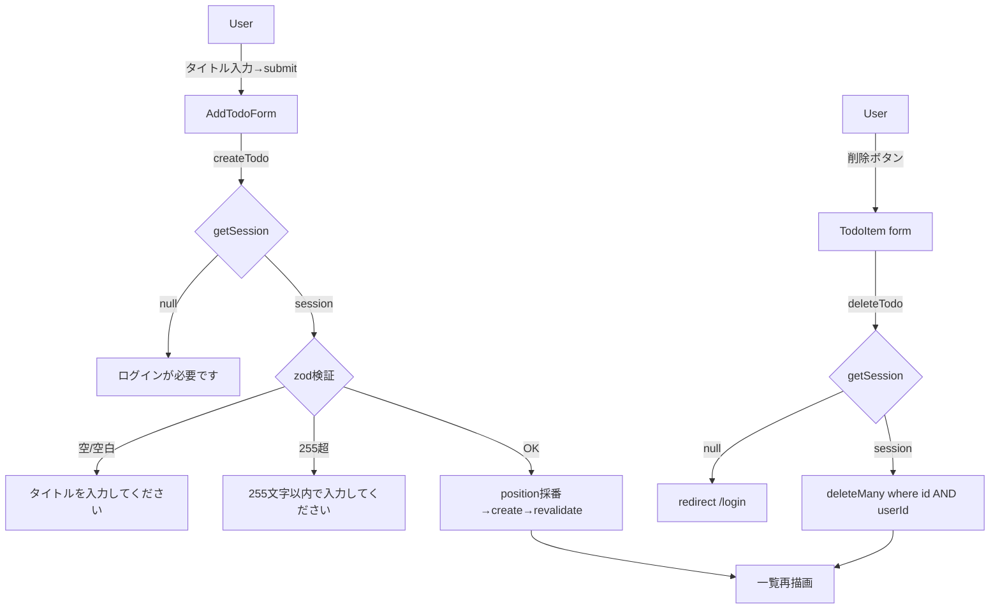

# 変更解説 (Linear Walkthrough) — Issue #10 TODO 追加・削除機能

- issue: #10 / branch: `feature/10-todo-crud` / base: `origin/main`
- 概要: ログインユーザーに紐づく TODO の一覧・追加・削除を Server Actions + `revalidatePath` で実装。スキーマ変更なし。

## 読む順序と各ファイルの役割

### 1. `app/actions/todos.ts`（新規・中核）

Server Actions を 2 つ定義する。両方とも冒頭で `getSession()` を呼び、middleware に依存しない多層防御で認証を再検証する。

- `createTodo(prev, formData)`:
  1. `getSession()` が `null` なら `{ error: 'ログインが必要です' }`（AC5）
  2. `TitleSchema = z.string().trim().min(1).max(255)` で検証。空・空白のみは `{ error: 'タイトルを入力してください' }`、255文字超は `too_big` を判定して `{ error: 'タイトルは255文字以内で入力してください' }`（AC2）
  3. `aggregate({ where: { userId }, _max: { position } })` で末尾 position を採番（初回 0）
  4. `prisma.todo.create` → `revalidatePath('/')` → `null` を返す（AC1）
  5. 予期せぬ例外は `console.error('[todos] createTodo error', { userId }, e)`（title 本文は出さない）
- `deleteTodo(formData)`:
  1. 未ログインは `redirect('/login')`（try/catch の外に置き `NEXT_REDIRECT` を握りつぶさない）
  2. `id` が文字列でない/空文字なら早期 return
  3. **所有者チェック**: `deleteMany({ where: { id, userId } })` の複合条件で他人の TODO には物理的に到達しない（TOCTOU 回避 / AC4）
  4. `revalidatePath('/')`

### 2. `app/components/AddTodoForm.tsx`（新規・'use client'）

`useActionState(createTodo, null)` で追加フォームを制御する。`role="alert"` にエラーを表示し（AC2 の UI）、pending 中はボタンを disable。成功時の入力欄クリアは `submittedRef` で「初回マウント」と「送信成功」を区別してから `form.reset()` する（初期状態と成功がともに `state===null` になるため、フラグで判別する）。

### 3. `app/components/TodoList.tsx`（新規・Server Component）

`userId` で絞り込み済みの `Todo[]` を受け取り `<ul>` で描画する（AC1）。各項目に hidden `id` を持つ削除フォーム（`<form action={deleteTodo}>`）を置く（AC3）。id が改ざんされても `deleteTodo` が `userId` スコープで絞るため他人の TODO は消せない。空時は「TODO がありません」。

### 4. `app/page.tsx`（変更・async Server Component 化）

`getSession()` で未ログインなら `/login` へ redirect（AC5）、`findMany({ where: { userId }, orderBy: { position: 'asc' } })` で一覧取得し、`AddTodoForm` / `TodoList` / 既存のログアウトフォームを合成する（AC1）。

### 5. `.eslintrc.json`（変更）

`"root": true` を 1 行追加。**理由**: 全作業を `.claude/worktrees/` 配下の worktree で行う運用上、ESLint（legacy config）が親リポジトリの上位 eslintrc まで遡って `@next/next` プラグインを二重ロードし `npm run lint` が失敗する。`root: true` で探索を打ち切る。CI はフラット clone のため無害。機能とは独立した lint 環境設定。

### 6. テスト

- `tests/todos/actions.test.ts`（統合12件）: 外部依存（`next/navigation` / `next/cache` / `@/lib/auth/session` / `@/lib/prisma`）のみモックし、実 DB（`testPrisma`）で検証。作成・空/空白/255超のバリデーション・未ログイン拒否・position 採番（連続 & userId スコープ）・自分削除・他人 TODO 非削除・自分削除+他人残存の複合・id 欠落 no-op・未ログイン redirect を網羅（AC1〜AC5）
- `tests/todos/AddTodoForm.test.tsx`（3件）: 描画・エラー表示・成功時クリア
- `tests/page.test.tsx`（更新2件）: 見出し + ログインユーザーの一覧表示

## 処理フロー

## 受入基準の対応

| AC | 内容 | 検証 |
|----|------|------|
| AC1 | 追加→即時反映&DB保存 | 自動（DB保存）+ 手動（UI即時反映） |
| AC2 | 空タイトル→エラー&未保存 | 自動（action + コンポーネント） |
| AC3 | 自分の削除→消える&DB削除 | 自動（DB）+ 手動（UI反映） |
| AC4 | 他人のid→認可エラー | 自動（deleteMany 複合条件） |
| AC5 | 未ログイン→ログイン誘導 | 自動（action拒否）+ 手動（middleware redirect） |

自動検証: 43 tests passed / tsc exit 0 / lint No errors。

## 手動テストチェックリスト

- [ ] AC1: ログイン→タイトル追加→リロードなしで一覧に即時表示される
- [ ] AC1: 追加成功後に入力欄がクリアされる
- [ ] AC2: 空/空白のみで追加→エラー表示され保存されない
- [ ] AC3: 削除ボタン→リロードなしで一覧から消える
- [ ] AC5: 未ログインで `/` に直接アクセス→`/login` へ redirect される

## 補足

- カバレッジ数値は `@vitest/coverage-v8` 未導入のため未計測（分岐はソース照合で網羅）
- position の `max+1` 採番は単一ユーザー逐次操作前提（同時追加の競合はリスク受容、並べ替えは #11/#12）
- `completed` トグル・編集・並べ替えは本 Issue スコープ外
