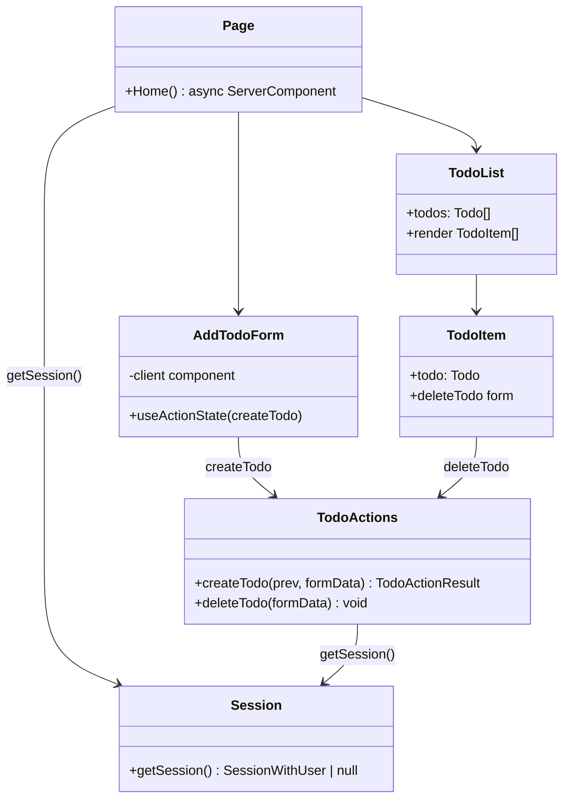
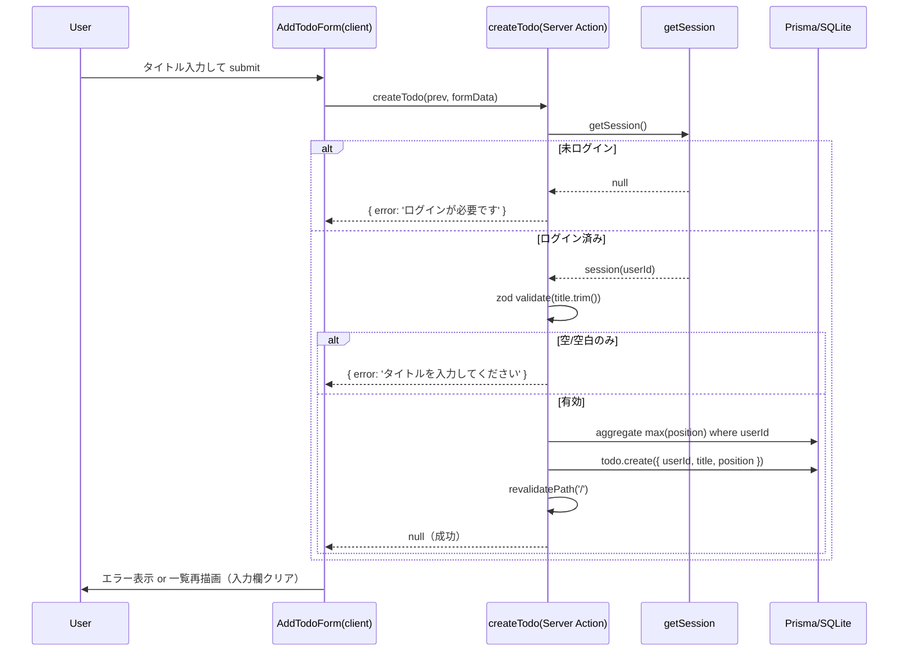
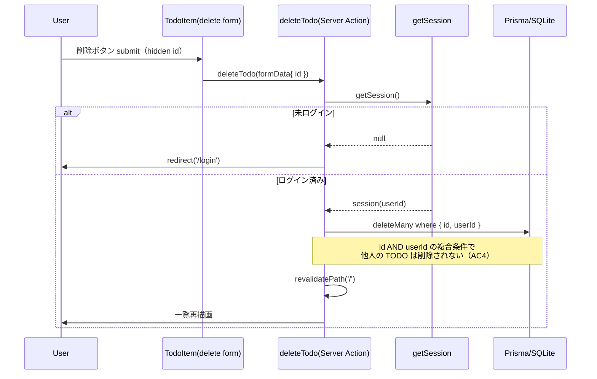

# Issue #10 実装計画 — TODO 追加・削除機能

- issue: https://github.com/kit-kamatsu-yuhi/todo-app/issues/10
- date: 2026-07-01
- branch: `feature/10-todo-crud`（worktree: `.claude/worktrees/10-todo-crud`、base: `origin/main` 86a7a21）
- labels: feat / priority:high / size:M
- 依存: #8（schema, merged）/ #9（email-auth, PR #15 merged）→ **依存解消済み**
- blocks: #11, #12

## 1. 要件分析

### 機能要件
- ログインユーザーに紐づく TODO 一覧を表示する（`userId` で絞り込み）
- タイトルを入力して TODO を追加できる（空タイトル・空白のみは不可）
- 各 TODO を削除できる
- 追加・削除は Server Actions + `revalidatePath('/')` で即時反映（ページ全体をリロードしない）
- 他ユーザーの TODO は操作・閲覧できない（所有者チェック）

### 非機能要件
- 未ログイン時はログイン画面へ誘導する（middleware + Server Action 両層で担保）
- 既存の認証基盤（`getSession()` / `middleware.ts` / `Session` モデル）を再利用する
- 既存の実装慣習に従う（`app/actions/` に Server Action、`useActionState` フォーム、zod バリデーション、`tests/helpers/db.ts` ベースの統合テスト）

### スコープ外（本 Issue では扱わない）
- 完了トグル（`completed` は default false のまま）
- 並べ替え / `position` の手動更新（#11・#12 が対象と想定。本 Issue は追加時に `position` を自動採番するのみ）
- 編集（タイトル更新）

### 受入基準の分類（AC1〜AC5）
| # | 受入基準 | 検証方法 |
|---|---------|---------|
| AC1 | ログイン状態でタイトル追加 → 一覧に即時反映 & DB 保存 | 自動（action 統合: DB 保存）+ 手動/E2E（UI 即時反映） |
| AC2 | 空タイトルで追加 → エラー & 保存されない | 自動（action 統合 + コンポーネント: エラー表示） |
| AC3 | 自分の TODO を削除 → 一覧から消え DB からも削除 | 自動（action 統合）+ 手動/E2E（UI 反映） |
| AC4 | 他人の TODO の id で削除 → 認可エラーで削除されない | 自動（action 統合: 所有者チェック） |
| AC5 | 未ログインで TODO 操作 → ログインへ誘導 | 自動（action 統合: 未認証で拒否）+ 手動/E2E（middleware redirect） |

## 2. UML 設計

### クラス図（今回のスコープ）


### シーケンス図: TODO 追加（AC1 / AC2）


### シーケンス図: TODO 削除（AC3 / AC4 / AC5）


## 3. Server Actions 設計（API に相当）

`app/actions/todos.ts`（`'use server'`）

| Action | シグネチャ | 説明 | 成功時 | 失敗時 |
|--------|-----------|------|--------|--------|
| `createTodo` | `(prev: TodoActionResult, formData: FormData) => Promise<TodoActionResult>` | title 検証 → 自分の TODO を作成 | `null`（+ revalidate） | `{ error }` |
| `deleteTodo` | `(formData: FormData) => Promise<void>` | hidden `id` を所有者チェック付きで削除 | void（+ revalidate） | 未ログインは `redirect('/login')`、非所有は no-op |

- `export type TodoActionResult = { error: string } | null`（auth の `AuthResult` と同形）
- バリデーション: `const TitleSchema = z.string().trim().min(1).max(255)`
- 追加時の `position`: `prisma.todo.aggregate({ where: { userId }, _max: { position: true } })` の値 +1（初回は 0）
- 削除の所有者チェック: `prisma.todo.deleteMany({ where: { id, userId: session.userId } })`（複合条件で他人の TODO を物理的に削除不可・件数 0 なら no-op）
- 未認証: `createTodo` は `{ error }` を返す（フォームにエラー表示）、`deleteTodo` は `redirect('/login')`

### エラーメッセージ（日本語・ユーザー向け）
- 未ログイン（create）: `ログインが必要です`
- 空/空白のみ: `タイトルを入力してください`
- 上限超過: `タイトルは255文字以内で入力してください`（zod のフィールド別メッセージ）
- サーバーエラー: `サーバーエラーが発生しました。しばらくしてから再試行してください`（auth と統一）

## 4. DB 設計

**スキーマ変更なし・マイグレーション不要。** `Todo` モデルは #8 で追加済み。

```
Todo {
  id String @id @default(cuid())
  userId String        // 絞り込み・所有者チェックに使用
  title String
  completed Boolean @default(false)   // 本 Issue では未使用
  position Int         // 追加時に max+1 で採番
  createdAt DateTime @default(now())
  updatedAt DateTime @updatedAt
  @@index([userId])    // 既存
}
```
- 一覧取得: `prisma.todo.findMany({ where: { userId }, orderBy: { position: 'asc' } })`
- 既存 `@@index([userId])` により一覧・削除の絞り込みは効率的

## 5. フロントエンド設計

### 画面・コンポーネント構成
```
app/page.tsx（async Server Component）
├─ getSession() → null なら redirect('/login')
├─ prisma.todo.findMany({ where: { userId }, orderBy: position asc })
├─ <AddTodoForm/>              … app/components/AddTodoForm.tsx（'use client'）
├─ <TodoList todos={todos}/>   … app/components/TodoList.tsx（Server Component）
│    └─ <TodoItem/> × n         … 削除フォーム（<form action={deleteTodo}>）
└─ <form action={logout}>（既存のログアウトボタンを維持）
```

### 状態管理
- サーバー状態（TODO 一覧）: Server Component で取得 → `revalidatePath('/')` で再取得。クライアント側 store は持たない
- フォーム状態: `AddTodoForm` で `useActionState(createTodo, null)` によりエラー・pending を管理
- 楽観更新は任意（Issue 記載どおり revalidate で即時反映を満たすため MVP では不採用。必要なら `useOptimistic` を後続で追加）

### ルーティング
- `/` … TODO 一覧 + 追加フォーム（保護ルート、middleware 対象）
- 未ログインアクセスは middleware が `/login` へ redirect（既存）

### バリデーション責務分担
- クライアント: `<input required>` で空送信を抑止（UX 向上のみ、信頼しない）
- サーバー: zod で `trim().min(1).max(255)`（正の検証境界。空白のみ・長すぎを最終防御）

### UI/UX
- 一覧はシンプルな `<ul>`。各項目にタイトルと削除ボタン
- 追加フォームは input + 追加ボタン。エラーは `role="alert"` で表示（login/signup と統一）
- 追加成功時に入力欄をクリア（`useActionState` の成功状態 or `key`/`ref` リセット）
- pending 中はボタン disable（既存フォームと統一）

## 6. セキュリティ基準

- **認可（所有者チェック / AC4）**: 削除は必ず `where: { id, userId }` の複合条件。`findUnique` 後に条件分岐する方式ではなく `deleteMany` の複合条件で物理的に他人の TODO へ到達不可にする（TOCTOU 回避）
- **認証（AC5）**: middleware は POST（Server Action）も含めルート `/` を保護するが、**多層防御として各 Action 内でも `getSession()` を必ず再検証**する（middleware 単独に依存しない）
- **入力バリデーション**: title は zod で trim + 長さ制限。SQL は Prisma のパラメータ化で SQLi 対策済み。XSS は React のエスケープに依存（`dangerouslySetInnerHTML` 不使用）
- **情報漏洩防止**: 一覧・削除ともに `userId` スコープ。他ユーザーの id 列挙による情報取得を不可にする
- **ログの機密情報**: エラーログに title 本文やユーザー入力を素で出さない（`userId` と操作種別のみ）

## 7. ロギング要件

| イベント | レベル | コンテキスト | 備考 |
|---------|-------|------------|------|
| createTodo 予期せぬ失敗 | ERROR | `userId`, 操作名 | title 本文は出さない |
| deleteTodo 予期せぬ失敗 | ERROR | `userId`, `todoId` | |
| 未認証アクセス（Action 到達時） | （任意）WARN | 操作名 | 通常は middleware で弾かれるため任意 |

- 形式は既存 auth 実装に合わせ `console.error('[todos] ...', e)`（正常系はログ出力しない）
- PII（email 等）はログに含めない

## 8. テスト戦略（testing skill 準拠）

テストピラミッド: 統合（Server Action + 実 DB）を主軸、コンポーネントは軽量に。E2E フルフローは手動確認。

### 自動テスト
**`tests/todos/actions.test.ts`（統合・主カバレッジ）** — auth テストと同じモック構成（`next/navigation`・`next/headers`・`next/cache` の `revalidatePath`・`@/lib/prisma` → `testPrisma`）。`@/lib/auth/session` の `getSession` をモックしてログインユーザーを制御。
- createTodo: 正常作成（DB に userId 紐づけで保存 / AC1）
- createTodo: 空文字 → `{ error }` & DB 未作成（AC2）
- createTodo: 空白のみ → `{ error }` & DB 未作成（AC2）
- createTodo: 未ログイン → `{ error }` & DB 未作成（AC5）
- createTodo: position 採番（2件目が max+1）
- deleteTodo: 自分の TODO 削除 → DB から消える（AC3）
- deleteTodo: 他ユーザーの TODO id → 削除されず件数不変（AC4）
- deleteTodo: 未ログイン → `redirect('/login')`、DB 不変（AC5）

**`tests/todos/AddTodoForm.test.tsx`（コンポーネント）**
- input と追加ボタンを描画する
- action がエラーを返したとき `role="alert"` にメッセージ表示（AC2 の UI）

**`tests/page.test.tsx`（既存を更新）**
- `Home` が async Server Component 化するため、`getSession` と `@/lib/prisma` をモックし `render(await Home())` で描画
- 見出し「todo-app」＋ 取得した TODO タイトルが一覧表示されることを確認

### 手動テスト / E2E（PR チェックリストに記載）
- AC1: ログイン→追加→リロードなしで一覧に出る
- AC3: 削除→リロードなしで消える
- AC5: 未ログインで `/` アクセス→`/login` へ redirect

### カバレッジ
- 追加・削除・認可・未認証の分岐を統合テストで網羅し 80% 以上を狙う

## 9. タスク分解と依存関係

実装は `codex-implement`、テストは `codex-test` が担当（`/codex-team` が並列起動）。各タスク 2h 以内。

1. **T1** `app/actions/todos.ts` に `createTodo`（session 検証・zod・position 採番・create・revalidate）… 1.5h
2. **T2** `app/actions/todos.ts` に `deleteTodo`（session 検証・所有者チェック deleteMany・revalidate）… 1h　依存: T1（同ファイル）
3. **T3** `app/components/AddTodoForm.tsx`（'use client'・useActionState・エラー表示・成功時クリア）… 1h　依存: T1
4. **T4** `app/components/TodoList.tsx` + TodoItem（削除フォーム）… 1h　依存: T2
5. **T5** `app/page.tsx` を async 化（session→redirect / findMany / 各コンポーネント合成 / logout 維持）… 1h　依存: T3,T4
6. **T6**（テスト）`tests/todos/actions.test.ts` … 2h　依存: T1,T2
7. **T7**（テスト）`tests/todos/AddTodoForm.test.tsx` … 1h　依存: T3
8. **T8**（テスト）`tests/page.test.tsx` 更新 … 0.5h　依存: T5
9. **T9**（ドキュメント）`raw/` に実装コンテキスト記録 … 0.5h

依存関係の要点: T1→T2/T3、T2→T4、T3+T4→T5。テストは対応実装後。

## 10. リスク分析と対策

| リスク | 影響 | 発生確率 | 対策 |
|--------|------|---------|------|
| async Server Component 化で既存 `tests/page.test.tsx` が壊れる | 中 | 高 | T8 で `render(await Home())` + モックへ更新（本計画に織り込み済み） |
| `position` の max+1 採番が同時追加で競合 | 低 | 低 | 単一ユーザーの逐次操作が前提。並べ替えは #11/#12 で再設計。本 Issue はリスク受容 |
| Server Action の未認証呼び出しを middleware 頼みにしてしまう | 高（認可バイパス） | 中 | 各 Action 内で `getSession()` 再検証（多層防御）をレビュー必須項目に |
| 他人の TODO 削除の認可漏れ（AC4） | 高 | 中 | `deleteMany({ where: { id, userId } })` 複合条件で担保 + AC4 テスト必須 |
| `next/cache` `revalidatePath` のテストモック漏れ | 低 | 中 | auth テストのモック構成を踏襲し `next/cache` もモック |
| コンポーネント配置（`app/components/`）が既存慣習と乖離 | 低 | 低 | 既存にコンポーネント dir がないため新設。route を生成しない `app/components/` を採用（`@/` パスで解決可） |

## 実行フロー

1. ✅ `/plan-issue` — 計画策定（完了）
2. ⬜ ユーザー承認 — plan.md + todos.md の内容を確認してもらう
3. ⬜ `/codex-team all` — 実装/テスト/レビュー（codex sub-agent チームで実行）
   - codex-implement + codex-test: 実装・テスト（Agent ツールで並列起動）
   - codex-review + review-agent: レビュー（Agent ツールで並列起動）
   - acceptance-criteria-agent: 受入基準 RED/GREEN 判定
4. ⬜ `/create-pr` — PR 作成（/walkthrough → changes.md → PR）
