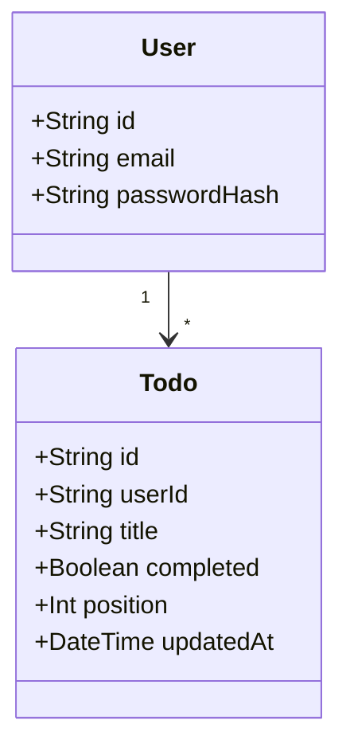
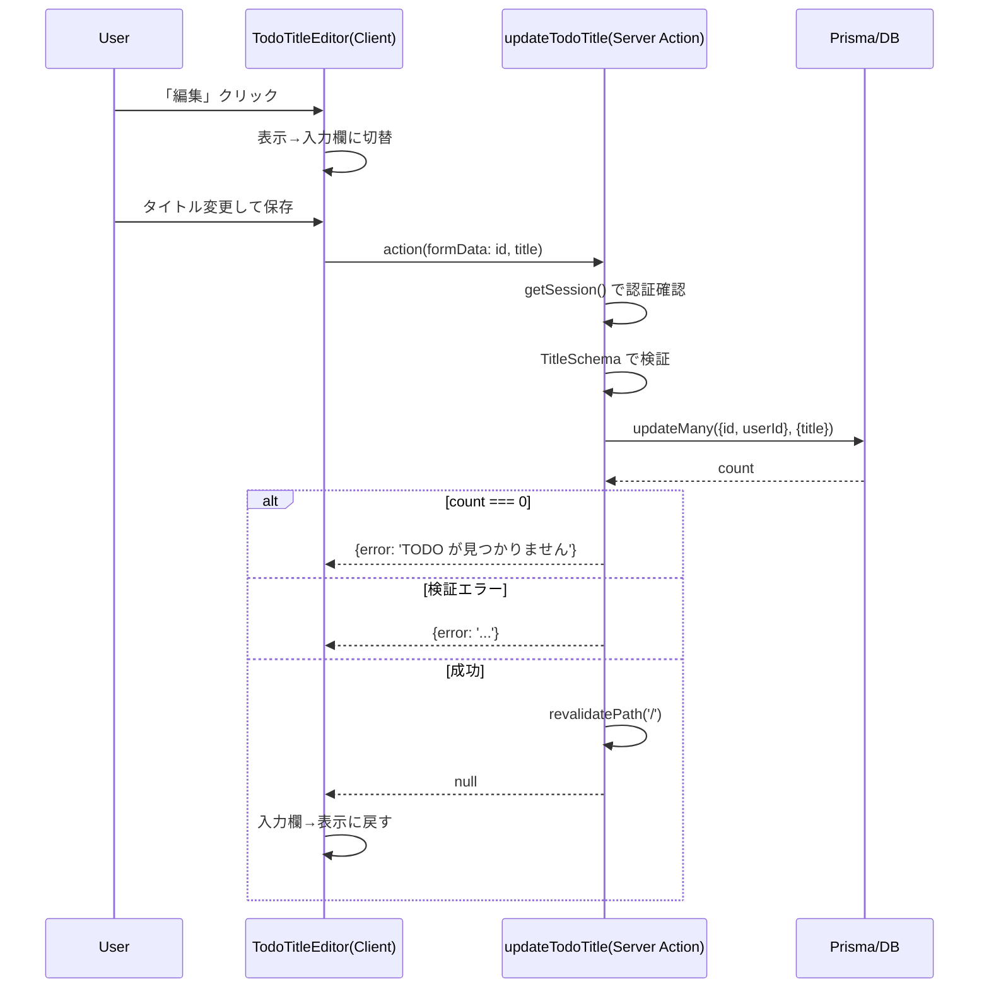
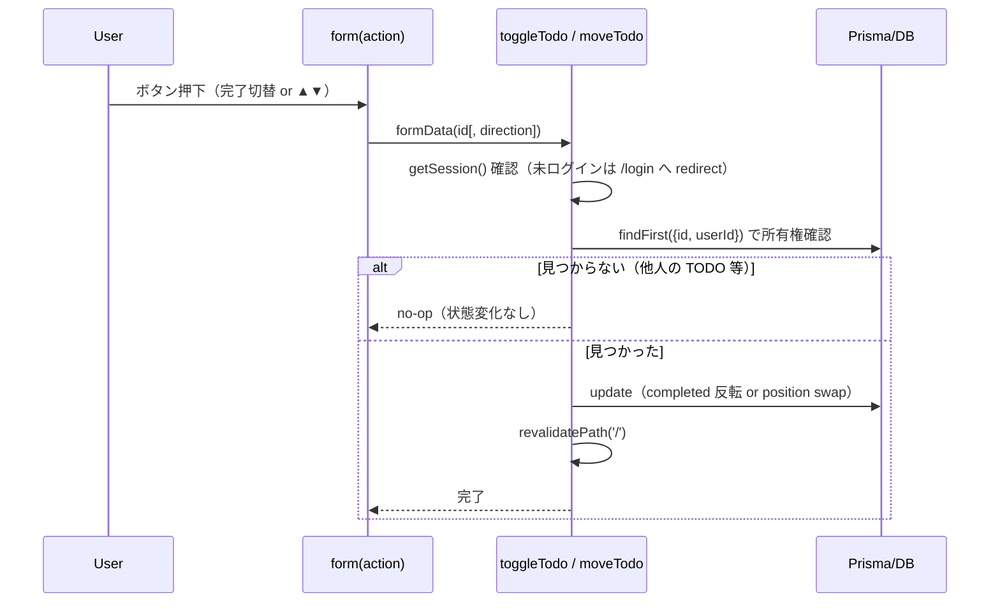

# Issue #11: TODO 編集・並び替え機能 実装計画

- date: 2026-07-01
- url: https://github.com/kit-kamatsu-yuhi/todo-app/issues/11
- 依存: #10（マージ済み・完了）
- worktree: `.claude/worktrees/11-todo-edit-reorder`
- branch: `feature/11-todo-edit-reorder`

## 1. 要件分析

### 機能要件
- TODO タイトルのインライン編集（空・空白のみは不可）
- 完了 / 未完了の切り替えと永続化
- 並び順の変更と `position` への永続化（再読み込み後も保持）
- 他ユーザーの TODO は編集・並び替え不可（認可チェック）

### 非機能要件
- Server Actions による progressive enhancement（JS 無効でも動作する範囲を最大化）
- 既存の `createTodo` / `deleteTodo` の認可パターン（`userId` 複合条件）を踏襲する

### ユーザー確認済みの設計判断
- **並び替え UI は ▲▼ ボタン方式**を採用する（dnd-kit は導入しない）。
  - 理由: 新規 npm 依存を追加せず、既存の `delete` フォームと同じ progressive enhancement パターンで実装・テストできる。dependencies.md の「既存の依存で代替できないか検討する」方針に合致する。
  - トレードオフ: ドラッグ操作の UX は持たないが、受け入れ条件（position 更新・再読み込み後の順序保持）は満たす。

### 受入基準のテスト分類

| 受入基準 | 分類 |
|---|---|
| 自分の TODO のタイトル編集 → 表示/DB 更新 | 自動テスト（Unit: Server Action） + 手動テスト |
| 空タイトルで編集保存 → エラーになり更新されない | 自動テスト（Unit: Server Action, Component） |
| 完了切り替え → `completed` 反転・再読み込み後保持 | 自動テスト（Unit: Server Action） + 手動テスト |
| 並び替え → `position` 更新・再読み込み後も順序保持 | 自動テスト（Unit: Server Action） + 手動テスト |
| 他人の TODO の id で編集・並び替え → 認可エラー | 自動テスト（Unit: Server Action, ownership） |

E2E テストは既存プロジェクトに E2E 基盤がないため対象外（`e2e` skill 未導入）。手動テストチェックリストは PR 本文に記載する。

## 2. UML 設計

### クラス図（既存モデル、変更なし）



### シーケンス図: タイトル編集



### シーケンス図: 完了切替 / 並び替え



## 3. API 設計（Server Actions）

DB マイグレーションが不要なため、REST エンドポイントではなく既存方針（Server Actions）を継続する。`app/actions/todos.ts` に追加する。

| Action | 入力 (FormData) | 戻り値 | 説明 |
|---|---|---|---|
| `updateTodoTitle` | `id`, `title` | `TodoActionResult`（`{error}` \| `null`） | タイトルをインライン編集。`useActionState` で使用 |
| `toggleTodo` | `id` | `void` | `completed` を反転。所有権確認は `findFirst({id, userId})` |
| `moveTodo` | `id`, `direction`（`'up'` \| `'down'`） | `void` | 隣接する TODO と `position` を入れ替える |

### エラーケース
- 未ログイン: `updateTodoTitle` は `{error: 'ログインが必要です'}` を返す（`createTodo` と同方針）。`toggleTodo` / `moveTodo` は `deleteTodo` と同様に `/login` へ redirect する。
- 空・空白のみタイトル: `{error: 'タイトルを入力してください'}`
- 255 文字超過: `{error: 'タイトルは255文字以内で入力してください'}`
- 他人の TODO への操作: `updateTodoTitle` は `{error: 'TODO が見つかりません'}`、`toggleTodo` / `moveTodo` は無変更で no-op（`deleteTodo` の既存方針を踏襲）

## 4. DB 設計

**変更なし。** `Todo` モデルは Issue #10 の時点で `completed` / `position` / `updatedAt` を既に持つため、新規マイグレーションは不要。

`moveTodo` の position swap はトランザクション（`prisma.$transaction`）で実行し、二重クリック等の競合時にも `position` の一意性（ユーザー内で 0..n-1 の連番）を保つ。

## 5. フロントエンド設計

### コンポーネント構成

```
app/page.tsx (Server Component, 変更なし: todos を取得して渡す)
└─ app/components/TodoList.tsx (Server Component)
   └─ 各 TODO ごとに:
      ├─ 完了切替フォーム（plain <form action={toggleTodo}>, JS 不要）
      ├─ TodoTitleEditor.tsx (Client Component, 新規) — 表示↔編集切替
      ├─ ▲▼ 並び替えフォーム（plain <form action={moveTodo}>, 先頭/末尾は disabled）
      └─ 削除フォーム（既存, 変更なし）
```

- **状態管理**: 表示↔編集の切替は `TodoTitleEditor` 内のローカル state（`useState`）のみで管理する。並び順・完了状態はサーバー状態（DB）が正であり、クライアントに複製しない（`revalidatePath('/')` で再取得）。
- **ルーティング**: 変更なし（`/` のみ）。
- **API 連携**: ユーザー操作時のみ（初回描画は `page.tsx` の `prisma.todo.findMany` のみ）。
- **バリデーション**: クライアント側は `required` 属性のみ（UX 補助）。サーバー側 `TitleSchema`（trim, min 1, max 255）が正となる。
- **UI/UX**: 既存プロジェクトは無装飾の素の HTML。今回も新規 CSS は追加せず、既存の見た目に合わせる。先頭 TODO の ▲ ボタン、末尾 TODO の ▼ ボタンは `disabled` にして誤操作を防ぐ。

## 6. セキュリティ基準

- **入力バリデーション**: タイトルは既存の `TitleSchema`（trim, min 1, max 255）を再利用する。`direction` は `'up' | 'down'` の 2 値のみ許可する（zod enum）。
- **認可**: すべての更新系操作は Prisma クエリの `where` に `userId: session.userId` を必ず含める（`updateMany` / `findFirst` の複合条件）。他人の TODO の id を渡された場合、クエリが 0 件になり物理的に到達しない（既存の `deleteTodo` と同じ多層防御パターン）。
- **認証**: 各 Server Action の先頭で `getSession()` を再検証する（middleware に依存しない）。
- **データ保護**: タイトル本文はログに出力しない（既存方針を継続、`userId` と `todoId` のみコンテキストに含める）。

## 7. ロギング要件

- `console.error('[todos] updateTodoTitle error', { userId, todoId }, e)` のように、既存の `createTodo`/`deleteTodo` と同じ形式でエラーログを出す。
- `toggleTodo` / `moveTodo` も DB 例外時は同様のフォーマットでログを出す。
- タイトル本文（機密扱い）はログに含めない。

## 8. テスト戦略

- **Unit（Server Actions）**: `tests/todos/actions.test.ts` に以下を追加する。
  - `updateTodoTitle`: 成功更新 / 空タイトルエラー / 空白のみエラー / 255文字超エラー / 未ログインエラー / 他人の TODO への操作は `{error}` かつ DB 不変
  - `toggleTodo`: 完了→未完了・未完了→完了の反転 / 再読み込み後も保持（DB 再取得で確認） / 他人の TODO は no-op / 未ログインは `/login` へ redirect
  - `moveTodo`: 上に移動で隣接 position 入れ替え / 下に移動で隣接 position 入れ替え / 先頭で上移動は no-op / 末尾で下移動は no-op / 他人の TODO の id では neighbor も不変 / 未ログインは `/login` へ redirect
- **Unit（Component）**: `tests/todos/TodoTitleEditor.test.tsx`（新規, `AddTodoForm.test.tsx` と同パターン）
  - 初期状態は表示モード（入力欄なし）
  - 「編集」クリックで入力欄が表示され `defaultValue` にタイトルが入る
  - 保存成功で表示モードに戻る
  - サーバーエラー時はエラーメッセージが表示され編集モードのまま
  - 「キャンセル」で編集前の表示に戻る
- **Unit（Component, 既存更新）**: `tests/todos/TodoList.test.tsx`（新規または既存拡張）
  - 先頭 TODO の ▲ ボタンが disabled
  - 末尾 TODO の ▼ ボタンが disabled
  - 完了済み TODO のボタン表示が未完了と異なる
- **カバレッジ目標**: 既存同様 80% 以上を維持する。追加コードは Server Action 中心のため、既存パターンで容易に到達可能。

## 9. タスク分解

### 実装タスク
- [ ] T1: `app/actions/todos.ts` に `updateTodoTitle` を追加（見積: 1h）
- [ ] T2: `app/actions/todos.ts` に `toggleTodo` を追加（見積: 0.5h）
- [ ] T3: `app/actions/todos.ts` に `moveTodo`（position swap, トランザクション）を追加（見積: 1.5h）
- [ ] T4: `app/components/TodoTitleEditor.tsx` を新規作成（見積: 1h、依存: T1）
- [ ] T5: `app/components/TodoList.tsx` を更新（toggle/move フォーム追加、TodoTitleEditor 組み込み、先頭/末尾 disabled 制御）（見積: 1h、依存: T2, T3, T4）

### テストタスク
- [ ] T6: `updateTodoTitle` の Unit テスト（見積: 1h、依存: T1）
- [ ] T7: `toggleTodo` の Unit テスト（見積: 0.5h、依存: T2）
- [ ] T8: `moveTodo` の Unit テスト（見積: 1h、依存: T3）
- [ ] T9: `TodoTitleEditor` の Component テスト（見積: 1h、依存: T4）
- [ ] T10: `TodoList` の Component テスト（disabled 制御・表示分岐）（見積: 0.5h、依存: T5）

### ドキュメントタスク
- [ ] T11: `raw/` に Issue #11 実装コンテキストを記録する（`/create-pr` 内、またはセッション終了時）

## 10. リスク分析

| リスク | 影響度 | 発生確率 | 対策 |
|---|---|---|---|
| `moveTodo` の position swap 中に競合（二重クリック等）で position が壊れる | 中 | 低 | `prisma.$transaction` で 2 件の update をアトミックに実行する |
| `TitleSchema` の重複定義（`createTodo` と `updateTodoTitle`）でロジックが分岐しうる | 低 | 中 | 同一ファイル内の既存 `const TitleSchema` を再利用し、複製しない |
| クライアント側 state（編集モード）とサーバー再取得のタイミングずれで編集中に他操作の revalidate が入り入力が消える | 低 | 低 | `TodoTitleEditor` はローカル state のみで input を制御し、`revalidatePath` 後も編集中の入力欄は自身の state 管理のため影響を受けない（React key が同じであれば入力継続、編集完了後のみ表示モードに戻す） |

## 実行フロー

1. ✅ `/plan-issue` — 計画策定（完了）
2. ⬜ ユーザー承認 — plan.md + todos.md の内容を確認してもらう
3. ⬜ `/codex-team all` — 実装/テスト/レビュー（codex sub-agent チームで実行）
   - codex-implement + codex-test: 実装・テスト（Agent ツールで並列起動）
   - codex-review + review-agent: レビュー（Agent ツールで並列起動）
   - acceptance-criteria-agent: 受入基準 RED/GREEN 判定
4. ⬜ `/create-pr` — PR 作成（/walkthrough → changes.md → PR）
