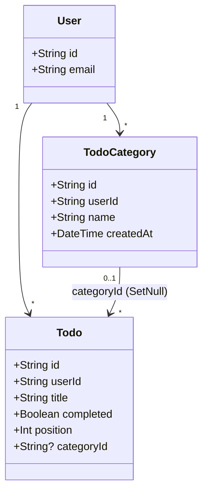
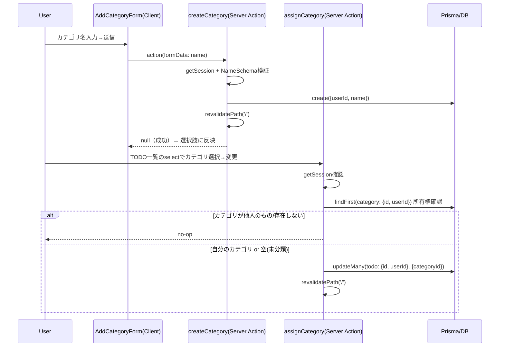
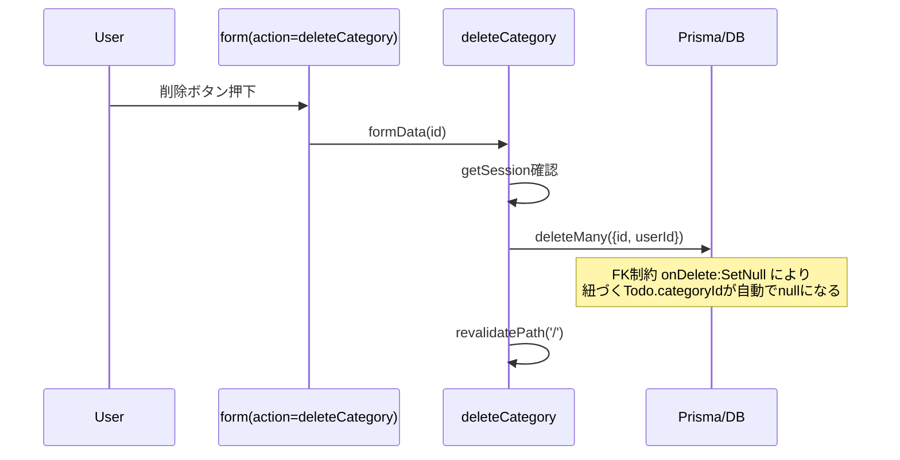
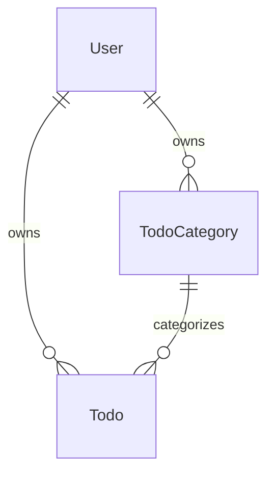

# Issue #12: TODO カテゴリ機能（TodoCategory テーブル）実装計画

- date: 2026-07-02
- url: https://github.com/kit-kamatsu-yuhi/todo-app/issues/12
- 依存: #8（マージ済み）, #10（マージ済み）
- worktree: `.claude/worktrees/12-todo-category`
- branch: `feature/12-todo-category`

## 1. 要件分析

### 機能要件
- `TodoCategory`（id, userId, name, createdAt）を追加する
- `Todo` にカテゴリ参照（`categoryId` nullable）を追加する
- カテゴリの作成・削除ができる（ログインユーザーに紐づく）
- TODO にカテゴリを割り当て / 解除できる
- カテゴリで TODO 一覧を絞り込める
- 他ユーザーのカテゴリは操作・閲覧できない
- 使用中カテゴリ削除時は、紐づく `Todo.categoryId` を null に更新する（TODO 自体は残す）

### 非機能要件
- 既存の Server Actions + `revalidatePath('/')` パターンを継続する
- 既存の認可パターン（`{id, userId}` 複合条件）を踏襲する
- 新規 npm 依存を追加しない（既存の `zod` / `prisma` のみで実現可能）

### 受入基準のテスト分類

| 受入基準 | 分類 |
|---|---|
| カテゴリ作成 → 保存され選択肢に出る | 自動テスト（Unit: Server Action, Component） |
| TODO へのカテゴリ割り当て → `categoryId` 更新・表示反映 | 自動テスト（Unit: Server Action） + 手動テスト |
| カテゴリで絞り込み → そのカテゴリの TODO のみ表示 | 自動テスト（Unit: page, DB クエリ） + 手動テスト |
| 使用中カテゴリ削除 → 紐づく TODO の `categoryId` が null、TODO は残る | 自動テスト（Unit: Server Action, DB制約） |
| 他人のカテゴリの id で操作 → 認可エラー | 自動テスト（Unit: Server Action, ownership） |

E2E テストは既存プロジェクトに E2E 基盤がないため対象外。手動テストチェックリストは PR 本文に記載する。

## 2. UML 設計

### クラス図



### シーケンス図: カテゴリ作成 → 割り当て



### シーケンス図: カテゴリ削除（使用中）



## 3. API 設計（Server Actions）

新規ファイル `app/actions/categories.ts` にカテゴリ自体の CRUD を、既存 `app/actions/todos.ts` に割り当て操作を追加する（Todo を変更する操作は todos.ts に集約する既存方針を継続）。

| Action | 配置 | 入力 (FormData) | 戻り値 | 説明 |
|---|---|---|---|---|
| `createCategory` | `categories.ts` | `name` | `CategoryActionResult`（`{error}` \| `null`） | カテゴリ作成。`useActionState` で使用 |
| `deleteCategory` | `categories.ts` | `id` | `void` | カテゴリ削除。`{id, userId}` 所有者チェック。紐づく Todo は DB の `onDelete: SetNull` で自動的に `categoryId` が null になる |
| `assignCategory` | `todos.ts` | `id`（todoId）, `categoryId`（空文字は未分類） | `void` | Todo のカテゴリ割り当て/解除。todo と category 両方の所有権を確認する |

絞り込みは Server Action ではなく、`page.tsx` が受け取る `searchParams.category` に応じたクエリで実現する（GET フォームによるページ遷移、JS 不要）。

### エラーケース
- 未ログイン: `createCategory` は `{error: 'ログインが必要です'}`。`deleteCategory`/`assignCategory` は既存の `deleteTodo` と同様に `/login` へ redirect。
- 空・空白のみカテゴリ名: `{error: 'カテゴリ名を入力してください'}`
- 50 文字超過: `{error: 'カテゴリ名は50文字以内で入力してください'}`
- 他人のカテゴリの id で削除: `deleteMany` の対象が 0 件になり無変更（`deleteTodo` と同方針）
- 他人のカテゴリの id を `assignCategory` に渡す: category の所有権確認で見つからず no-op（Todo 側は変更されない）
- 他人の Todo の id を `assignCategory` に渡す: todo の所有権確認で見つからず no-op

## 4. DB 設計

### 変更内容

```prisma
model TodoCategory {
  id        String   @id @default(cuid())
  userId    String
  user      User     @relation(fields: [userId], references: [id], onDelete: Cascade)
  name      String
  createdAt DateTime @default(now())
  todos     Todo[]

  @@index([userId])
}

model Todo {
  // ...既存フィールド...
  categoryId String?
  category   TodoCategory? @relation(fields: [categoryId], references: [id], onDelete: SetNull)

  // ...既存index/unique...
  @@index([categoryId])
}
```

- `TodoCategory.name` に一意制約は付けない（Issue に明記がなく、同名カテゴリの禁止は要件外と判断。将来必要になれば `@@unique([userId, name])` を追加する）
- `onDelete: SetNull` により、カテゴリ削除時の `Todo.categoryId` null 化は DB の FK 制約レベルで保証される（アプリケーション側で個別に null 更新するロジックは不要）
- 新規マイグレーション: `add_todo_category`（`TodoCategory` テーブル作成 + `Todo.categoryId` カラム追加、既存 Todo は `categoryId = NULL`。破壊的操作なし）

### ER 図



## 5. フロントエンド設計

### コンポーネント構成

```
app/page.tsx (Server Component)
├─ searchParams.category を読み取り、todos/categories を並列取得
├─ AddTodoForm（既存、変更なし）
├─ AddCategoryForm.tsx（Client, 新規）— カテゴリ作成フォーム
├─ CategoryList.tsx（Server, 新規）— 絞り込みGETフォーム + カテゴリ一覧(削除ボタン付き)
└─ TodoList.tsx（Server, 更新）— 各TODOに割り当てselect(categories props追加)を追加
```

- **状態管理**: フィルタ状態は URL の query param（`?category=<id>`）がソースオブトゥルース。クライアント側に複製しない。
- **ルーティング**: `/` に `?category=<id>` を追加（`searchParams` は Next.js 15 の非同期 props として受け取る）
- **API 連携**: `page.tsx` の初回描画時に `prisma.todo.findMany`（`categoryId` 条件付き）と `prisma.todoCategory.findMany` を並列取得する
- **UI/UX**: 絞り込みは `<form method="get">` の `<select name="category">` + 送信ボタンで実現し、JS 無しでも動作する。カテゴリ割り当ても `<select name="categoryId">` + 送信ボタンの plain form（`assignCategory`）とし、新たな Client Component は追加しない
- **バリデーション**: カテゴリ名はサーバー側 `NameSchema`（trim, min 1, max 50）が正。フロントは `required` 属性のみ

## 6. セキュリティ基準

- **入力バリデーション**: カテゴリ名は `NameSchema = z.string().trim().min(1).max(50)`
- **認可**:
  - `deleteCategory`: `deleteMany({ where: { id, userId } })` で複合条件により他人のカテゴリに物理的に到達しない
  - `assignCategory`: Todo 側は `updateMany({ where: { id, userId } })`、category 側は割り当て前に `findFirst({ where: { id: categoryId, userId } })` で所有権を確認し、他人のカテゴリへの参照を防ぐ
  - 絞り込みクエリは常に `userId: session.userId` を条件に含めるため、他人の categoryId を URL に指定しても他人の TODO が漏れることはない（自分の TODO の中に該当 category を持つものが無ければ 0 件になるだけ）
- **認証**: 各 Server Action の先頭で `getSession()` を再検証する
- **データ保護**: カテゴリ名はタイトルと異なり機密性は低いが、既存方針に合わせ例外ログには含めない

## 7. ロギング要件

- `console.error('[categories] createCategory error', { userId }, e)` の形式で既存パターンを継続
- `deleteCategory` / `assignCategory` も同様のフォーマットでエラーログを出す

## 8. テスト戦略

- **Unit（Server Actions）**: `tests/categories/actions.test.ts`（新規）
  - `createCategory`: 成功 / 空名エラー / 空白のみエラー / 50文字超エラー / 未ログインエラー
  - `deleteCategory`: 自分のカテゴリ削除 / 他人のカテゴリは no-op / 使用中カテゴリ削除で紐づく Todo の `categoryId` が null になり Todo 自体は残る / 未ログインは `/login` redirect
- **Unit（Server Actions, 既存ファイル拡張）**: `tests/todos/actions.test.ts` に `assignCategory` を追加
  - 自分の Todo に自分のカテゴリを割り当て → `categoryId` 更新
  - 割り当て解除（空文字 → null）
  - 他人のカテゴリの id を割り当てようとすると no-op（Todo の `categoryId` は変化しない）
  - 他人の Todo の id を渡すと no-op
  - 未ログインは `/login` redirect
- **Unit（DB制約）**: `tests/schema.test.ts` に「カテゴリ削除時に Todo.categoryId が null になる」ケースを追加
- **Unit（Component）**: `tests/categories/AddCategoryForm.test.tsx`（新規, `AddTodoForm.test.tsx` と同パターン）
- **Unit（Component, 既存拡張）**: `tests/todos/TodoList.test.tsx` に categories props を渡した場合の select 表示を追加
- **Unit（page）**: `tests/page.test.tsx` を更新し `prisma.todoCategory.findMany` のモックを追加。`?category=` クエリに応じて `prisma.todo.findMany` の `where` に `categoryId` が渡ることを検証
- **カバレッジ目標**: 既存同様 80% 以上を維持する

## 9. タスク分解

### 実装タスク
- [ ] T1: `prisma/schema.prisma` に `TodoCategory` モデルと `Todo.categoryId` を追加しマイグレーション生成（見積: 1h）
- [ ] T2: `app/actions/categories.ts` に `createCategory` / `deleteCategory` を追加（見積: 1h、依存: T1）
- [ ] T3: `app/actions/todos.ts` に `assignCategory` を追加（見積: 1h、依存: T1）
- [ ] T4: `app/components/AddCategoryForm.tsx` を新規作成（見積: 0.5h、依存: T2）
- [ ] T5: `app/components/CategoryList.tsx` を新規作成（絞り込みGETフォーム + 一覧・削除）（見積: 1h、依存: T2）
- [ ] T6: `app/components/TodoList.tsx` を更新（categories props 追加、割り当てselect追加）（見積: 0.5h、依存: T3）
- [ ] T7: `app/page.tsx` を更新（searchParams対応、todos/categories並列取得、新規コンポーネント組み込み）（見積: 1h、依存: T4, T5, T6）

### テストタスク
- [ ] T8: `createCategory` / `deleteCategory` の Unit テスト（見積: 1h、依存: T2）
- [ ] T9: `assignCategory` の Unit テスト（見積: 1h、依存: T3）
- [ ] T10: カテゴリ削除時の DB SetNull 制約テスト（`tests/schema.test.ts` 拡張）（見積: 0.5h、依存: T1）
- [ ] T11: `AddCategoryForm` の Component テスト（見積: 0.5h、依存: T4）
- [ ] T12: `TodoList` / `page.tsx` の既存テスト更新 + 絞り込みのテスト（見積: 1h、依存: T6, T7）

### ドキュメントタスク
- [ ] T13: `raw/` に Issue #12 実装コンテキストを記録する

## 10. リスク分析

| リスク | 影響度 | 発生確率 | 対策 |
|---|---|---|---|
| `assignCategory` で category の所有権確認を怠ると他人のカテゴリに Todo が紐づいてしまう | 高 | 低 | `findFirst({id: categoryId, userId})` を割り当て前に必ず実行するようテストで明示的に検証する |
| SQLite で `onDelete: SetNull` が Prisma のマイグレーション上正しく FK 制約として生成されない可能性 | 中 | 低 | マイグレーション生成後に SQL を確認し、`tests/schema.test.ts` で実際に削除→null化を検証する |
| `page.tsx` の `searchParams` 対応で既存の `tests/page.test.tsx` が壊れる（引数なし呼び出し） | 中 | 中 | `searchParams` を optional（`Promise<{...}> \| undefined`）として受け取り、既存テストの `Home()` 呼び出しでも動作するようにする。合わせてテストを更新する |
| 同名カテゴリが複数作成できる（一意制約なし） | 低 | 中 | Issue 要件外のため今回は許容。UX 上の改善は別 Issue で検討する |

## 実行フロー

1. ✅ `/plan-issue` — 計画策定（完了）
2. ⬜ ユーザー承認 — plan.md + todos.md の内容を確認してもらう
3. ⬜ `/codex-team all` — 実装/テスト/レビュー（codex sub-agent チームで実行）
   - codex-implement + codex-test: 実装・テスト（Agent ツールで並列起動）
   - codex-review + review-agent: レビュー（Agent ツールで並列起動）
   - acceptance-criteria-agent: 受入基準 RED/GREEN 判定
4. ⬜ `/create-pr` — PR 作成（/walkthrough → changes.md → PR）
