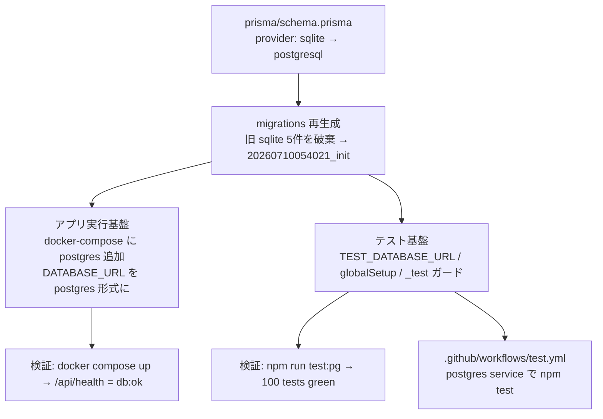

# Changes: Issue #20 — Prisma を SQLite から PostgreSQL へ移行

Cloud SQL(PostgreSQL) 接続（Week 9）の前提として、Prisma の datasource を SQLite から
PostgreSQL に切り替えた。モデル定義は不変で、provider・マイグレーション・実行/テスト基盤を移行した。

## 変更の全体像

## ファイル別の変更

**スキーマ / マイグレーション**
- `prisma/schema.prisma`: datasource `provider` を `postgresql` に。先頭の陳腐化コメントを整理。
- `prisma/migrations/`: 旧 SQLite マイグレーション 5 件を削除し、PostgreSQL 用 `20260710054021_init` を再生成。`migration_lock.toml` を `postgresql` に。全モデル・`@@unique([userId,position])`・各 index・FK(cascade/set null) を含む。

**実行基盤**
- `docker-compose.yml`: `postgres:16-alpine` の `db` サービス（healthcheck 付き）を追加。`app` の `DATABASE_URL` を postgres に、`depends_on: db(service_healthy)`。named volume を `postgres-data` に（旧 `db-data` の SQLite 残骸との衝突を回避）。
- `Dockerfile`: SQLite 用データディレクトリ作成（`/app/data`）を削除。
- `.env.example`: `DATABASE_URL` を postgres プレースホルダに（実機密なし）。
- `next.config.ts` / `app/layout.tsx`: 陳腐化した SQLite 参照を PostgreSQL/Prisma に更新。
- `.gitignore`: SQLite 固有エントリを整理（汎用 `*.db` は維持）。

**テスト**
- `tests/helpers/test-db-url.ts`（新規）: `TEST_DATABASE_URL` と `assertTestDatabase()`（DB 名 `*_test` を強制する破壊防止ガード）を共有。
- `tests/helpers/db.ts`: postgres 接続に変更。`cleanDb()` を `TRUNCATE ... CASCADE` に。
- `tests/helpers/global-setup.ts`（新規）: スイート開始前に一度だけ `prisma migrate deploy`。
- `tests/todos/reorder.test.ts`（新規・3 テスト）: `moveTodo` の一時退避ロジックが `@@unique([userId,position])` の PostgreSQL 即時評価下でも制約違反しないことを回帰検証。
- `vitest.config.ts`: `globalSetup` 登録。直列実行方針は維持。
- `scripts/test-with-postgres.sh`（新規）: 一時 postgres 起動 → `migrate deploy` → `vitest` → 後始末。既定ポート 15432（開発 5432 と非衝突）、コンテナ名に PID。
- `package.json`: `test:pg` スクリプト追加。

**CI / ドキュメント**
- `.github/workflows/test.yml`（新規）: postgres service を供給し `npm test` を実行。
- `README.md`: 技術スタック・Docker・テスト手順を PostgreSQL 前提に更新。CI 前提・破壊防止ガードを明記。

## reorder（並び替え）の安全性

`app/actions/todos.ts` の `moveTodo` は既に `$transaction` 内で一時 position `-1` へ退避してから入れ替える実装で、position は常に 0 以上のため衝突しない。PostgreSQL の即時制約評価でも各ステートメント境界で `(userId, position)` の重複が起きず、コード変更は不要（回帰テストでガード）。

## レビュー対応（gcp-infra 系ではなく codex-review / review-agent）

- volume `db-data` 流用 → `postgres-data` にリネーム（既存環境の postgres 起動不能を回避）
- テスト既定ポート 5432 → 15432（衝突回避）
- `_test` ガード追加（開発/本番 DB への誤爆防止）
- Dockerfile の SQLite 残骸削除、陳腐化コメント掃除、`TEST_DATABASE_URL` 共通化、`RESTART IDENTITY` no-op 修正
- CI 供給前提を README + workflow で明記

## 動作確認

- `npm run test:pg`: 14 files / **100 tests passed**
- `npx tsc --noEmit`: pass
- `docker compose up`: `/api/health` → `{"status":"ok","db":"ok"}`
- 機密（接続文字列）はコミットしていない（`.env` は gitignore、追跡は `.env.example` のみ）

## 受入基準

| 基準 | 結果 |
|------|------|
| postgres で `/api/health`=db:ok | GREEN |
| 既存 CRUD が postgres で動作 | GREEN |
| `npm test` 相当 green | GREEN（100 passed） |
| 接続文字列を非コミット | GREEN |

Closes #20
