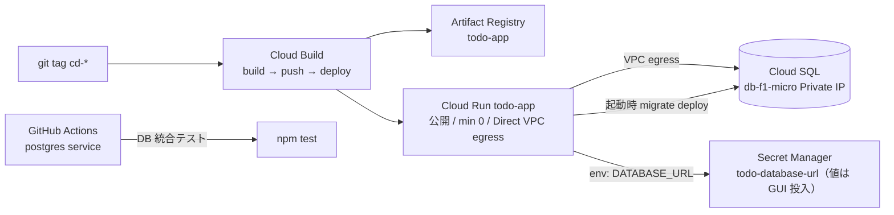

# Changes: Issue #21 — GCP インフラ拡張（Secret + 公開 Cloud Run + Cloud Build、最小構成）

W8 由来の Terraform を最小構成に作り替え、Secret Manager・公開 Cloud Run・Cloud Build タグデプロイを積んだ。コスト最小化のため VPC Access コネクタと Bastion/IAP を廃止し、Cloud Run の Direct VPC egress に統一した。実 apply と到達確認は #22 で行う。

## アーキテクチャ

## ファイル別の変更

**ネットワーク / コンピュート**
- `network.tf`: VPC Access コネクタ削除。Direct VPC egress 用 `todo-egress-subnet`。PSA レンジは `/24` に縮小。
- `compute.tf`: Cloud Run を Direct VPC egress（`network_interfaces` + `PRIVATE_RANGES_ONLY`）に。`ingress` 明示。初回はプレースホルダ image（起動時 migrate は実イメージの CMD が担う）。`image`/`command`/`args` を `ignore_changes`。公開は `allow_unauthenticated` 変数でゲート。**Bastion 削除**。
- `Dockerfile`: CMD を `migrate deploy && node server.js` に変更（Cloud Run / compose 共通で起動時マイグレーション）。

**DB / Secret**
- `database.tf`: `random_password`/`secret_version` を廃止。Secret `todo-database-url` は枠のみ。`google_sql_user` は `password_wo` + `password_wo_version`（変数）で state に平文を残さない。
- Secret 値（DATABASE_URL）は apply 後に GUI/gcloud で投入（二段階 apply）。

**IAM（最小権限）**
- `iam.tf`: run SA = secret 単位の `secretAccessor` + `logging.logWriter`（`cloudsql.client` は Direct egress + パスワード認証で不要のため削除）。Cloud Build SA = `run.developer` + リポジトリ単位の `artifactregistry.writer` + `logging.logWriter` + run SA への actAs（リソース単位）。Cloud Build サービスエージェントへ build SA の `serviceAccountTokenCreator`。**Bastion SA / IAP 全廃**、プロジェクト全体の `serviceAccountUser` は付与しない。

**CI/CD**
- `registry.tf`（新規）: Artifact Registry（Docker）。
- `cloudbuild.tf`（新規）: 1st-gen トリガー `ci-*`（build + `tsc`。DB 非依存）/ `cd-*`（build→push→deploy）。
- `cloudbuild.yaml`（新規）: docker build → AR push → `gcloud run deploy --quiet`。
- `services.tf`: cloudbuild/artifactregistry を追加、vpcaccess/iap を削除。
- `versions.tf`: `required_version >= 1.11`（`password_wo` 要件）。
- `variables.tf` / `outputs.tf` / `terraform.tfvars`: connector/iap 系を削除、`db_password`/`db_password_version`/`allow_unauthenticated`/`github_*` を追加。`database_url_template` は `sensitive`。

## レビュー対応（gcp-infra-review-agent + codex-review）

| 指摘 | 対応 |
|------|------|
| F1: secret version 未投入で初回 apply 失敗（+ プレースホルダ distroless で command 上書き不可） | 二段階 apply を README 明記。初回リビジョンから command 上書きを外し、migrate は実イメージの CMD に統合 |
| F2: `password_wo` は TF≥1.11 必須 | `required_version >= 1.11` |
| S1: Cloud Build SA にプロジェクト全体 serviceAccountUser | 削除（リソース単位 actAs のみ） |
| I1: 1st-gen カスタム SA に service agent の token creator 必要 | `serviceAccountTokenCreator` を追加 |
| I3: run.admin 過剰 | `run.developer` に |
| I4: CI の `npm test` が DB 必須で赤化 | build + `tsc` に変更。DB テストは GitHub Actions |
| Should: secretAccessor/artifactregistry.writer がプロジェクト全体 | secret 単位 / リポジトリ単位に限定 |
| Should: run SA の cloudsql.client 不要 | 削除 |
| Nit: PSA /16 過大・images 冗長・invoker ゲート・template sensitive | /24・images 削除・`allow_unauthenticated`・`sensitive` |

## 動作確認

- `terraform fmt` / `terraform validate`: pass（**valid**）。
- `terraform plan`: 前回フル plan は 31 add で green。今回の修正（IAM/設定中心）は validate で確認済み。**実 plan/apply は #22 で実施**（GCP 再認証が必要）。
- 機密の非混入: `password_wo`（state 非保存）、Secret は枠のみ、`terraform.tfvars`/outputs にパスワードなし、`*.auto.tfvars` は gitignore。

## 受入基準

| 基準 | 状態 |
|------|------|
| Direct VPC egress でコネクタ無し | ✅（`network_interfaces`、コネクタ resource 無し） |
| 機密がコード/state に無い | ✅（password_wo・secret 枠のみ・非コミット tfvars） |
| `ci-*`/`cd-*` トリガー定義 | ✅（`todo-ci` / `todo-cd`。実登録は #22 で GitHub App 接続後） |

Closes #21
