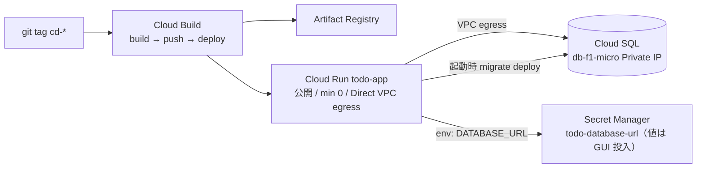

# 実装計画: Issue #21 GCP インフラ拡張（Secret + 公開 Cloud Run + Cloud Build、最小構成）

対象: https://github.com/kit-kamatsu-yuhi/todo-app/issues/21
worktree: `.claude/worktrees/21-gcp-infra`（branch `feature/21-gcp-infra`）
前提: #20（アプリ PostgreSQL 化）マージ済み。既存 `terraform/`（#19 由来）を作り替える。

## 1. 要件分析

**受入基準**
- `terraform apply` 成功。VPC コネクタ無し（Direct VPC egress）で Cloud Run → Cloud SQL 到達。
- Secret の平文がコード/tfstate に無い（DATABASE_URL の値は GUI 投入）。
- `ci-*` / `cd-*` の Cloud Build トリガーが登録される。

**分類**
- 手動/統合: apply 後の到達確認・トリガー登録確認（#22 で実デプロイ検証）。
- セキュリティ基準: 機密の非コミット・非 state（ソース照合）。

## 2. アーキテクチャ（最小構成）

## 3. 既存 terraform からの差分方針

| ファイル | 変更 |
|---------|------|
| `network.tf` | **VPC Access コネクタ削除**（`connector_cidr` 変数も）。Direct VPC egress 用に subnet を 1 つ用意（bastion 用 subnet を流用・リネーム）。PSA は維持。bastion 削除に伴い IAP SSH firewall は削除 |
| `compute.tf` | Cloud Run を **Direct VPC egress**（`template.vpc_access.network_interfaces`）に変更。`image` はプレースホルダ + `lifecycle.ignore_changes`（実イメージは Cloud Build がデプロイ）。**未認証許可（公開）** = `allUsers` に `roles/run.invoker`。`DATABASE_URL` を Secret から env 注入（単一接続文字列）。起動コマンドで `migrate deploy` 実行。**bastion 削除** |
| `database.tf` | Cloud SQL は維持（`db-f1-micro`/ENTERPRISE/Private IP/PITR無効）。`random_password`・`secret_version` を**廃止**。app DB user の password は `password_wo`（未コミット tfvar）で state 非保存。Secret は `todo-database-url` の**枠のみ**（version は TF 非管理） |
| `iam.tf` | run SA: `secretmanager.secretAccessor` + `logging.logWriter`（+ `cloudsql.client`）。bastion SA・IAP binding 削除。**Cloud Build SA** 追加（`run.admin` / `artifactregistry.writer` / `iam.serviceAccountUser` / `logging.logWriter`） |
| 新規 `registry.tf` | Artifact Registry（Docker, asia-northeast1） |
| 新規 `cloudbuild.tf` | Cloud Build トリガー `ci-*`（build+test）/ `cd-*`（build+push+deploy）。GitHub 2nd-gen connection 参照 |
| 新規 `cloudbuild.yaml` | build → push AR → deploy Cloud Run（migrate は Cloud Run 起動時に実行） |
| `services.tf` | `cloudbuild.googleapis.com` / `artifactregistry.googleapis.com` 追加。`vpcaccess` は Direct egress のため不要 |
| `scripts/connect-db.sh` | bastion 削除に伴い削除（DB デバッグは #22 で別途 or Cloud SQL Studio） |

## 4. Secret 設計（機密をコード/state に置かない）

- Secret `todo-database-url` を**枠のみ** TF 定義（replication auto、version は作らない）。
- 値 `postgresql://todo_app:<PW>@<Cloud SQL Private IP>:5432/todo?schema=public` は **apply 後に GUI/gcloud で投入**（version 追加）。
- app DB user のパスワードは `google_sql_user.password_wo`（未コミットの tfvars で渡す）→ state に平文が残らない。
- Cloud Run は `DATABASE_URL` を secret `latest` から注入。初回は secret version 未投入だと起動失敗するため、**apply → GUI で値投入 → デプロイ**の順を README に明記。

## 5. Cloud Build / GitHub 連携（手動設定あり）

- **手動設定（Terraform 不可）**: Cloud Build 1st-gen の GitHub 連携（Cloud Build GitHub App のリポジトリへのインストール + 認可）。GCP Console で実施。connection リソースは作らず、`google_cloudbuild_trigger` の `github {}` ブロックで owner/name を参照する。App 未接続だとトリガーの apply が失敗する。
- トリガー: `ci-*`（`_ci` 相当。build + `npm test`）、`cd-*`（build → push AR → Cloud Run deploy）。
- マイグレーション: Cloud Build 既定ワーカーは Cloud SQL Private IP へ到達不可。よって **Cloud Run コンテナ起動時に `prisma migrate deploy`**（Direct VPC egress 経由で到達）で適用する。#20 の Docker イメージは prisma CLI + 完全 node_modules を同梱済みで対応可能。

## 6. セキュリティ / ロギング

- 機密は Secret Manager のみ。コード・tfvars（コミット対象）・tfstate に平文を置かない。
- Cloud Run 公開は `allUsers` invoker のみ（アプリ側認証は既存のセッション認証）。
- Cloud Build SA / run SA は最小権限。

## 7. テスト戦略

- インフラは terraform `validate` + `plan` で検証。apply は #22 の実デプロイ検証で確認。
- アプリのユニット/統合テストは #20 で整備済み（本 Issue では変更なし）。

## 8. リスクと対策

| リスク | 影響 | 対策 |
|--------|------|------|
| Cloud Build GitHub 連携が手動 | 中 | 手動手順を README/plan に明記。connection 作成後に trigger apply |
| secret version 未投入で Cloud Run 起動失敗 | 中 | apply → GUI 投入 → デプロイの順序を明記。初回はプレースホルダ image で service だけ作る |
| Direct VPC egress の provider スキーマ差異 | 低 | google 6.x の `network_interfaces` を使用。plan で確認 |
| Cloud Build 既定ワーカーが Private IP 未到達 | 中 | migrate を Cloud Run 起動時に寄せる（上記） |
| password_wo 未対応の provider version | 低 | 6.x で対応。不可なら gcloud で後設定に切替 |

## 9. 判断が必要な点（承認時に確認）

1. **Bastion**: 最小構成のため**削除**を推奨（アプリ運用に不要）。DB デバッグは Cloud SQL Studio 等で代替。keep-stopped 継続も可。
2. **Secret/password**: DATABASE_URL は GUI 投入、DB password は `password_wo`（未コミット tfvar）。この方式でよいか。
3. **Cloud Build GitHub 連携の手動ステップ**を許容するか（TF 化不可の部分）。

## 実行フロー

1. ✅ `/plan-issue` — 計画策定（完了）
2. ⬜ ユーザー承認
3. ⬜ `/codex-team all` — 実装/テスト/レビュー
4. ⬜ `/create-pr` — PR 作成
