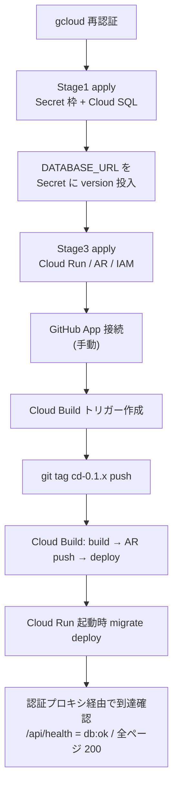

# Changes: Issue #22 タグデプロイ実行と到達確認

#21 で定義した GCP インフラを実際にデプロイし、`cd-*` タグ push による自動デプロイと、Secret 経由の DB 接続でアプリが動くことをブラウザ（認証アクセス）で確認した。実デプロイ中に判明した非オーナー権限・組織ポリシーの制約に対応する小修正を含む。

## デプロイ〜到達のフロー

## 実施内容
- gcloud 再認証 → 二段階 apply（Secret 枠 + Cloud SQL → Private IP で DATABASE_URL を Secret 投入 → 全体 apply）。
- GitHub App を手動接続し、Cloud Build `ci-*`/`cd-*` トリガーを作成。
- `cd-0.1.0` → `cd-0.1.1` タグ push で Cloud Build が起動し、実イメージをビルド→Artifact Registry→Cloud Run へ自動デプロイ（revision 00002→00003）。
- 起動時 `prisma migrate deploy` が Cloud SQL にスキーマ適用（ログで確認）。
- 認証付きプロキシ（`gcloud run services proxy`）経由でブラウザ到達を確認。

## 実デプロイで判明した制約と対応（本 PR の差分）
| 制約 | 対応 |
|------|------|
| 実行ユーザーが secret / Artifact Registry の **resource 単位 setIamPolicy 権限を持たない** | 当該 IAM 付与を **プロジェクト単位**（`google_project_iam_member`）に変更 |
| 組織ポリシーが **allUsers 公開を禁止**（PROJECT_SET_IAM_DISALLOWED_MEMBER_TYPE） | 完全公開をやめ、**指定ユーザーへ run.invoker**（認証アクセス）。到達確認は `gcloud run services proxy` |
| 認証プロキシ経由だと Next.js の **Server Actions が origin 不一致で拒否** | `next.config.ts` に `serverActions.allowedOrigins`（localhost:8080 + Cloud Run ホスト）を追加 |

## 動作確認（証跡）
- cd ビルド SUCCESS（`todo-cd` トリガー、revision `todo-app-00003` が 100% 配信）。
- 認証プロキシ経由: `/` `/login` `/signup` `/api/health` すべて **200**、`/api/health` = `{"status":"ok","db":"ok"}`、トップに `todo-app`。
- ブラウザでサインアップ/ログイン/Todo 操作を人手で確認（データは実 Cloud SQL に永続化）。

## 受入基準
| 基準 | 結果 |
|------|------|
| `cd-*` タグ push → Cloud Build → Cloud Run 自動デプロイ | ✅ |
| Secret 経由の DB 接続でアプリが動作 | ✅（health db:ok・実 PostgreSQL） |
| ブラウザから到達 | ✅（org ポリシーで allUsers 不可のため認証アクセスで確認） |

## 補足
- 完全公開（allUsers）は org 管理者の org policy 例外が必要。本 Issue は認証アクセスで到達確認とした。
- 確認完了後 `terraform destroy` で撤去し課金停止する。

Closes #22
