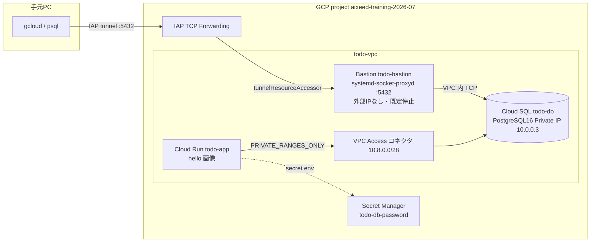
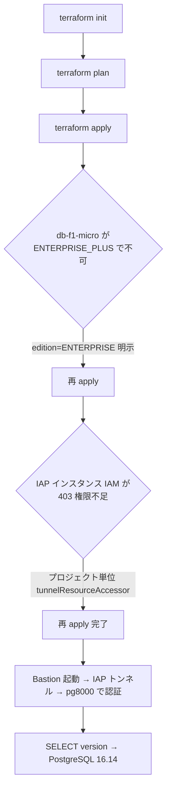

# Changes: Week 8 — TODO アプリ用 GCP インフラの Terraform 化

TODO アプリの土台となる GCP リソース（VPC / IAM / Cloud Run / Cloud SQL + Bastion + IAP）を
Terraform で定義し、`init → plan → apply` して IAP トンネル経由の psql 疎通まで確認した。
アプリ本体のデプロイと CI/CD は Week 9 のため、Cloud Run は空コンテナ（hello 画像）に留める。

## ファイル構成

`terraform/` を新規追加。関心ごとにファイルを分割している。

| ファイル | 役割 |
|---------|------|
| `versions.tf` | required_version / provider (google ~> 6.0, random) |
| `providers.tf` | google provider（project / region / zone） |
| `variables.tf` | 入力変数（project_id, region, CIDR, DB 設定, iap_user） |
| `services.tf` | 必要 API の有効化（`disable_on_destroy=false`） |
| `network.tf` | VPC / Bastion サブネット / VPC Access コネクタ(/28) / IAP 用ファイアウォール / PSA |
| `database.tf` | Cloud SQL(PostgreSQL 16, Private IP only) / DB / ユーザー / Secret Manager |
| `iam.tf` | ワークロード別 SA（run / bastion）と最小権限、IAP tunnel アクセス |
| `compute.tf` | Cloud Run（空コンテナ）/ Bastion VM（systemd-socket-proxyd） |
| `outputs.tf` | Cloud Run URL / DB 接続情報 / 接続ヒント / db_password(sensitive) |
| `terraform.tfvars` | project_id と iap_user |
| `scripts/connect-db.sh` | IAP トンネルを開き psql 接続を案内するスクリプト |

## アーキテクチャと接続経路

## 適用と検証の流れ

## 主要な設計判断

- **Cloud SQL は edition=ENTERPRISE を明示**。未指定だと ENTERPRISE_PLUS 既定になり共有コア `db-f1-micro` が使えない。
- **IAP はプロジェクト単位の `roles/iap.tunnelResourceAccessor`**。インスタンス単位 IAM 設定は `iap.tunnelInstances.setIamPolicy`（オーナー相当）が要り、実行ユーザーは未保有のため。
- **Bastion は apt 非依存の `systemd-socket-proxyd`** で TCP リレー。外部 IP / Cloud NAT を持たないため apt 取得に依存させない。Cloud SQL の Private IP は Terraform 既知値を埋め込み、Bastion SA から cloudsql 権限を排除。
- **DB パスワードは `random_password` → Secret Manager**。実行ユーザーは Secret 読取不可のため、ローカル検証では `terraform output -raw db_password`（state 由来）を使う。
- **学習用の割り切り**: `deletion_protection=false` / PITR 無効 / ローカル state。本番は GCS backend・REGIONAL・Cloud Run ingress 制限へ。

## レビュー反映（gcp-infra-review-agent）

- `connect-db.sh` の最終行から `exec` を除去（`trap ... EXIT` を活かし Bastion を自動停止）。
- startup script を `apt-get install socat` → `systemd-socket-proxyd` に変更し外部依存を排除。
- Bastion SA の `roles/cloudsql.client` を削除（プロキシは IAM 不要）。
- PITR 無効・`disk_autoresize_limit` 追加。

## 動作確認

- `terraform validate` 成功 / `terraform plan` 差分どおり適用。
- IAP トンネル経由で `todo_app` として Cloud SQL に接続し `SELECT version()` → `PostgreSQL 16.14` を確認。
- 検証後、Bastion は自動停止。

Issue: なし（Week 8 宿題。GitHub Issue 起票なし）
