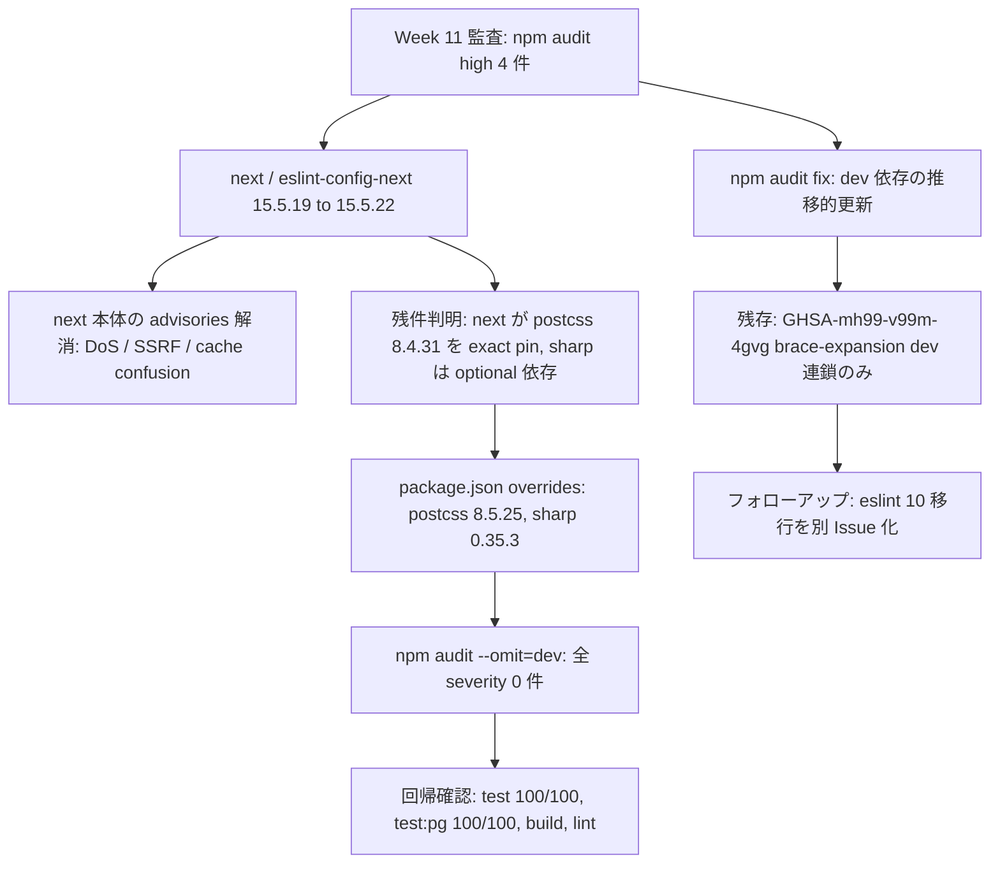

# Changes: Issue #26 next 15.5.22 更新と npm audit high 解消

- date: 2026-07-30
- branch: feature/26-next-security-patch
- 種別: 依存関係の更新のみ（アプリコード変更なし）

## 全体フロー

## 変更ファイルの構造

| ファイル | 変更内容 |
|---------|---------|
| `package.json` | next / eslint-config-next を 15.5.22 に更新（固定表記維持）。`overrides` に postcss 8.5.25 / sharp 0.35.3 を追加 |
| `package-lock.json` | 上記の反映。差分は next 系・sharp（@img/* 27 パッケージ）・postcss・nanoid・brace-expansion・@eslint/eslintrc のみ。全 entry の integrity を registry と突合済み |
| `raw/issues/2026-07-30_26/` | plan.md（実装計画）、todos.md（タスク・全完了）、result.md（audit 結果・残存リスク判断・運用メモ） |

## 判断ポイント

1. postcss は next 15.5.22 が 8.4.31 を exact pin しているため `npm audit fix` では動かせない。同一メジャー内の 8.5.25 へ overrides で強制した
2. sharp は next の optionalDependencies `^0.34.3` の範囲外となる 0.35.3 へ強制。next/image は未使用のため休眠依存だが、advisory 解消を優先した。engines は node >=20.9.0 で本プロジェクトの Node 22 と整合
3. brace-expansion（GHSA-mh99-v99m-4gvg）は dev 専用連鎖で、解消には eslint 10 への破壊的更新が必要。本 PR では許容し別 Issue とする

## 運用メモ

next 更新のたびに overrides の要否を再確認する。next 側が pin を更新したら overrides を削除する。
