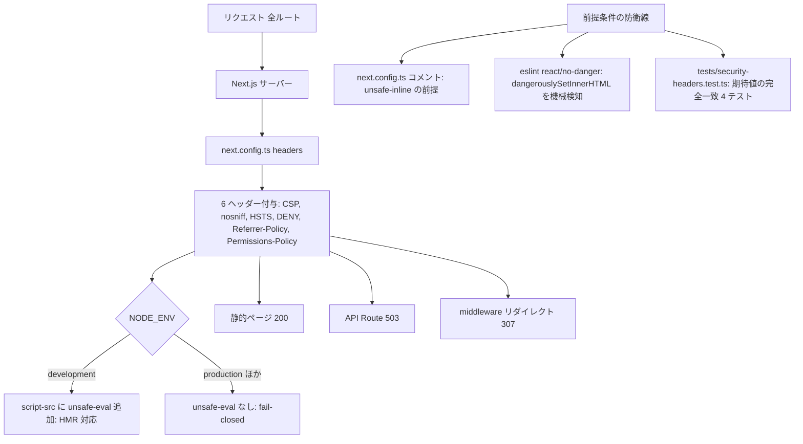

# Changes: Issue #27 セキュリティヘッダーの全ルート付与

- date: 2026-07-30
- branch: feature/27-security-headers
- 種別: next.config.ts への headers() 追加 + 検証テスト新規 + lint ルール追加

## 全体フロー

## 変更ファイルの構造

| ファイル | 変更内容 |
|---------|---------|
| `next.config.ts` | `headers()` を追加（+56 行程度）。`source: '/(.*)'` で全ルートに 6 ヘッダー。CSP は配列 join で組み立て、`NODE_ENV === 'development'` のときのみ `'unsafe-eval'` を追加。'unsafe-inline' 許容の前提条件と nonce 移行トリガーをコメントで明記 |
| `.eslintrc.json` | `react/no-danger: error` を追加。CSP 前提条件（DOM 直接挿入ゼロ）の破れを lint で検知 |
| `tests/security-headers.test.ts` | 新規 4 テスト。全ルート source パターン、6 ヘッダーの期待値完全一致（`toHaveLength(6)` で過不足検知）、NODE_ENV 両分岐（production に unsafe-eval なし / development にあり） |
| `raw/issues/2026-07-30_27/` | plan.md（設計判断: nonce 見送り）、todos.md、result.md（採用 CSP・plan からの変更点・手動テスト残） |

## 判断ポイント

1. nonce ベースの厳格 CSP は見送った。Next.js の仕様で全ページが動的レンダリングに強制され、/login /signup の静的生成が失われる。本アプリは DOM 直接挿入ゼロ・外部リソースゼロ（レビューで grep により独立再確認）のため、'unsafe-inline' 許容の静的 CSP で開始する
2. 前提が崩れたときに気づける仕掛けを 2 つ入れた。`react/no-danger` の lint エラーと next.config.ts の前提条件コメント
3. `'unsafe-eval'` の分岐は plan の `!== 'production'` からレビュー指摘で `=== 'development'` の fail-closed に変更（test・未設定環境への混入防止）

## 読み方

採用した CSP 値と手動テストの残項目は `result.md` を読む。実装は `next.config.ts` の headers() 1 箇所に閉じている。
