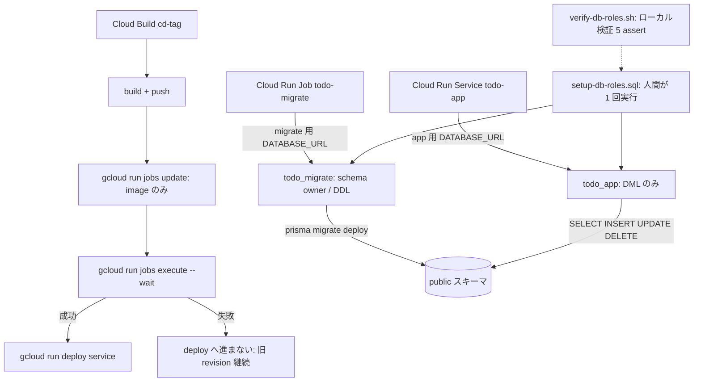

# Changes: Issue #28 DB ユーザーの権限分離と GRANT 最小化

- date: 2026-08-03
- branch: feature/28-db-role-separation
- 種別: Terraform + デプロイパイプライン + SQL スクリプト（アプリコード変更なし）

## 全体フロー

## 変更ファイルの構造

| ファイル | 変更内容 |
|---------|---------|
| `terraform/jobs.tf`（新規） | Cloud Run Job `todo-migrate`。service と同じ Direct VPC egress、cloud_run SA 流用、migrate 用 Secret を DATABASE_URL に注入、`max_retries = 0`、image は lifecycle ignore で CD 委譲 |
| `terraform/database.tf` | `google_sql_user.migrate`（password_wo 方式）、Secret 枠 `todo-database-url-migrate`、両 SQL ユーザーに `deletion_policy = "ABANDON"` |
| `terraform/variables.tf` | `db_migrate_user` / `db_migrate_password` / `db_migrate_password_version` |
| `terraform/cloudbuild.tf` | cd トリガーの substitutions に `_JOB` を配線 |
| `cloudbuild.yaml` | build → push → **job 更新 → execute --wait** → deploy の順序に変更。`timeout: 1200s` |
| `Dockerfile` | CMD から migrate を除去し `node server.js` のみに（compose は自前 command で migrate 継続） |
| `scripts/sql/setup-db-roles.sql` | 所有権移転（REASSIGN + `ALTER SCHEMA public OWNER TO todo_migrate`）、GRANT 最小化、cloudsqlsuperuser membership の条件付き剥奪、DEFAULT PRIVILEGES。単一トランザクション・冪等 |
| `scripts/sql/verify-db-roles.sh` | ローカル PostgreSQL で本番相当状態を再現し 5 assert（migrate 成功 / CREATE 拒否 / ALTER・DROP 拒否 / CRUD 成功 / DEFAULT PRIVILEGES）を検証 |
| `raw/issues/2026-07-30_28/` | plan.md / todos.md / result.md（人間実行手順書・残存リスク・運用メモ）/ changes.md |

## 判断ポイント

1. migrate の実行環境は Cloud Run Job。Cloud Build 既定ワーカーは Cloud SQL Private IP に到達できないため、VPC 内で同一イメージを command 上書きで動かす
2. `execute --wait` の非ゼロ終了で migrate 失敗時は deploy に進まず、旧 revision が動き続ける（fail-safe）
3. Cloud SQL 固有の cloudsqlsuperuser 継承（PG15+ では public スキーマ owner）に対し、schema 所有権の移転と条件付き membership 剥奪を SQL に組み込んだ。それでも実機での CREATE 拒否確認を手順書の停止ゲートにしている
4. SA は app と Job で共有。secret 単位 IAM が使えない現行制約では分割しても分離にならないため許容し、残存リスクとして result.md に記録

## 読み方

実機投入の手順と停止条件は `result.md` の「人間実行手順書」を読む。SQL の意図はステップ単位のコメントに書いてある。terraform apply・Secret 投入・SQL 実行・cd タグ push はすべて人間実行。
