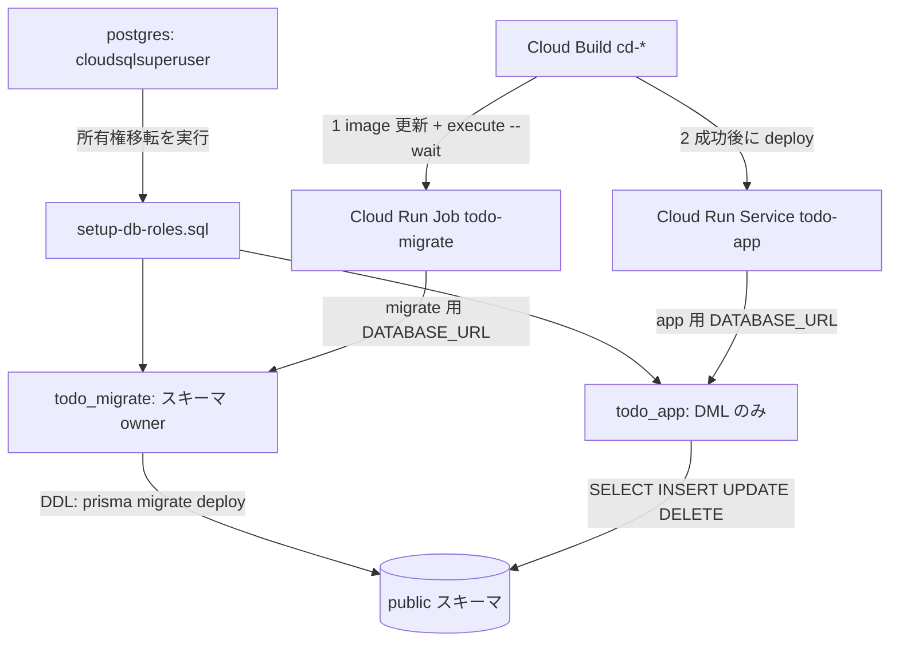

# Issue #28 実装計画: DB ユーザーの権限分離（app / migration）と GRANT 最小化

- date: 2026-07-30
- issue: https://github.com/kit-kamatsu-yuhi/todo-app/issues/28
- branch: feature/28-db-role-separation

## 1. 要件分析

現状は `todo_app` 単一ユーザーが DDL（`prisma migrate deploy`、Dockerfile CMD で起動時実行）と DML の両方を担う。Week 11 監査の指摘に基づき、migration 用と app 用を分離して app 側を DML のみに最小化する。

### 現状の制約と前提

| 事実 | 影響 |
|------|------|
| Cloud Build 既定ワーカーは Cloud SQL Private IP に到達不可（cloudbuild.tf のコメントに明記） | migrate は Cloud Build ステップでは実行できない。VPC 内で動く **Cloud Run Job** を migrate 実行環境にする |
| docker-compose は自前の `command`（migrate && server）を持つ | Dockerfile の CMD から migrate を外してもローカル開発は壊れない |
| 実行ユーザーは非オーナー（secret 単位の setIamPolicy 不可、terraform apply は人間実行） | GRANT の初期投入 SQL も人間が db-connect（IAP + Bastion）経由で実行する。AI は script 生成まで |
| 既存テーブルは todo_app が作成済み（owner = todo_app） | 所有権を todo_migrate へ移す REASSIGN が必要 |

### 変更対象

| 領域 | 変更 |
|------|------|
| Terraform | `google_sql_user.migrate`（todo_migrate、password_wo 方式）、migrate 用 DATABASE_URL の Secret 枠、`google_cloud_run_v2_job.migrate`（同イメージ・command 上書き・同 VPC egress・Cloud Run 実行 SA 流用、image は lifecycle ignore） |
| SQL | `scripts/sql/setup-db-roles.sql`（所有権移転 + GRANT 最小化 + ALTER DEFAULT PRIVILEGES。人間が 1 回実行） |
| Dockerfile | CMD を `node server.js` のみに変更（migrate を除去） |
| cloudbuild.yaml | deploy 前に migrate job の image 更新 + `gcloud run jobs execute --wait` を挿入 |
| 検証 | `scripts/sql/verify-db-roles.sh`（ローカル PostgreSQL で権限分離を再現検証） |

## 2. 権限設計（DB 設計に相当）

### setup-db-roles.sql の内容（postgres ユーザーで実行）

1. `GRANT todo_app TO "postgres"` / `GRANT todo_migrate TO "postgres"`（Cloud SQL では REASSIGN に両ロールへの membership が必要）
2. `REASSIGN OWNED BY todo_app TO todo_migrate`（既存テーブル・`_prisma_migrations` を含む全オブジェクトの所有権移転）
3. `REVOKE CREATE ON SCHEMA public FROM PUBLIC;` / `REVOKE ALL ON SCHEMA public FROM todo_app;`
4. `GRANT USAGE ON SCHEMA public TO todo_app;` / `GRANT CREATE ON SCHEMA public TO todo_migrate;`
5. `GRANT SELECT, INSERT, UPDATE, DELETE ON ALL TABLES IN SCHEMA public TO todo_app;`（`_prisma_migrations` にも DML が付くが、migrate 状態の参照のみで DDL は不可のため許容）
6. `ALTER DEFAULT PRIVILEGES FOR ROLE todo_migrate IN SCHEMA public GRANT SELECT, INSERT, UPDATE, DELETE ON TABLES TO todo_app;`（今後 migrate が作るテーブルに自動付与）
7. シーケンスにも同様の GRANT / DEFAULT PRIVILEGES（現状 cuid 主キーでシーケンス未使用だが、将来の autoincrement 追加に備える）

## 3. API 設計 / 5. フロントエンド設計

対象外。アプリコード・エンドポイントに変更はない（接続文字列の向き先が Secret 経由で変わるのみ）。

## 4. インフラ設計（Terraform）

- `variables.tf`: `db_migrate_user`（default: todo_migrate）、`db_migrate_password`（sensitive）、`db_migrate_password_version` を追加。未コミットの `secrets.auto.tfvars` で渡す
- `database.tf`: `google_sql_user.migrate` と `google_secret_manager_secret.database_url_migrate` を追加（値の version は既存の database_url と同様、apply 後に人間が投入）
- `compute.tf`（または新規 `jobs.tf`）: `google_cloud_run_v2_job.migrate`
  - image はプレースホルダ（hello）で作成し `lifecycle.ignore_changes` で CD に委譲（既存 service と同じパターン）
  - command: `node node_modules/prisma/build/index.js migrate deploy`
  - env DATABASE_URL ← database_url_migrate secret
  - vpc_access は service と同じ Direct VPC egress
  - service_account は既存の cloud_run SA を流用（secretAccessor がプロジェクト単位のため追加 IAM 不要）
- cloudbuild.yaml: `gcloud run jobs update todo-migrate --image ... --region ...` → `gcloud run jobs execute todo-migrate --wait` → 既存の `gcloud run deploy`。migrate 失敗時は `--wait` が非ゼロ終了しデプロイが止まる

## 6. セキュリティ基準

- app 接続は DML のみとなり、アプリの RCE / SQL 注入が起きてもスキーマ破壊・権限昇格に到達しない（本 Issue の目的）
- パスワードは既存パターンを踏襲: `password_wo` で state に平文を残さず、Secret の値は人間が投入。todo_app と todo_migrate は別パスワード
- setup-db-roles.sql に資格情報を含めない（ロール名のみ）
- terraform plan までを AI が実施し、apply / SQL 投入 / cd-* タグ push は人間が実行する（security skill の IaC 原則）

## 7. ロギング要件

- Cloud Run Job の実行ログは既存の logging.logWriter で Cloud Logging に出る。migrate の適用結果（applied migrations）がログに残ることをデプロイ手順の確認事項に含める

## 8. テスト戦略

DDL 権限の分離は GCP 実環境でしか完全再現できないため、ローカル再現スクリプト + 実環境手動確認の 2 段構えとする。

1. **ローカル自動検証**: `scripts/sql/verify-db-roles.sh` — postgres:16 一時コンテナで todo_app / todo_migrate を作成 → setup-db-roles.sql を適用 → (a) todo_migrate で `prisma migrate deploy` 成功、(b) todo_app で `CREATE TABLE` が permission denied、(c) todo_app で CRUD が成功、を assert する
2. **既存スイート回帰**: `npm run test` / `npm run test:pg`（テスト用 DB は単一ユーザーのままで影響なし）
3. **build 検証**: `npm run build`、Dockerfile の CMD 変更後に `docker compose up` でローカル起動確認（compose は自前 command で migrate を継続）
4. **実環境（人間実行）**: terraform apply → Secret 投入 → setup SQL 投入 → cd-* タグ → staging で job 成功と app 動作を確認

## 9. タスク分解

| # | タスク | 依存 | 見積もり |
|---|--------|------|---------|
| 1 | Terraform: migrate ユーザー・Secret 枠・Cloud Run Job・variables 追加 | - | 1.5h |
| 2 | scripts/sql/setup-db-roles.sql 作成 | - | 1h |
| 3 | Dockerfile CMD 変更 + cloudbuild.yaml に migrate ステップ挿入 | 1 | 0.5h |
| 4 | scripts/sql/verify-db-roles.sh 作成とローカル実行 | 2 | 1.5h |
| 5 | terraform fmt / validate、既存スイート回帰、compose 起動確認 | 1-4 | 1h |
| 6 | raw/ 記録 + 人間実行手順書（apply → Secret → SQL → タグ push の順序） | 5 | 0.5h |

## 10. リスク分析

| リスク | 影響 | 確率 | 対策 |
|--------|------|------|------|
| REASSIGN OWNED が Cloud SQL の権限モデルで失敗する | 高 | 中 | 事前に verify-db-roles.sh のローカル再現で手順を検証。postgres への両ロール GRANT を script 冒頭に含める |
| Cloud Build SA に run.jobs 系権限が不足（roles/run.developer の範囲） | 中 | 低 | run.developer は jobs の update/execute を含む。plan 段階で `gcloud iam roles describe roles/run.developer` により確認するタスクを含める（不足時は roles/run.developer 相当の追加をユーザーへ提案） |
| migrate job 成功前に旧 CMD 前提の revision が動き続ける移行期間の不整合 | 中 | 低 | デプロイ順序を「job 更新・実行 → service デプロイ」に固定。切替リリースはスキーマ変更を含まないタグで行う |
| ALTER DEFAULT PRIVILEGES の適用漏れで新テーブルに todo_app の DML が付かない | 中 | 中 | verify スクリプトで「migrate がテーブル追加 → todo_app が DML 可能」を assert に含める |
| PR サイズ 500 行超過 | 低 | 中 | lockfile なしの実コード + SQL + ドキュメントで 500 行以内を見込む。超過時は verify スクリプトを別 PR に分離 |

## 実行フロー

1. ✅ `/plan-issue` — 計画策定（完了）
2. ⬜ ユーザー承認 — plan.md + todos.md の内容を確認してもらう
3. ⬜ `/codex-team all` — 実装/テスト/レビュー（codex sub-agent チームで実行）
   - codex-implement + codex-test: 実装・テスト（Agent ツールで並列起動）
   - codex-review + review-agent + gcp-infra-review-agent: レビュー（Agent ツールで並列起動。Terraform 変更のため GCP インフラレビューを追加）
   - acceptance-criteria-agent: 受入基準 RED/GREEN 判定
4. ⬜ `/create-pr` — PR 作成（/walkthrough → changes.md → PR）
5. ⬜ 人間実行: terraform apply → Secret 投入 → setup-db-roles.sql 投入（db-connect 経由）→ cd-* タグ push → staging 確認
