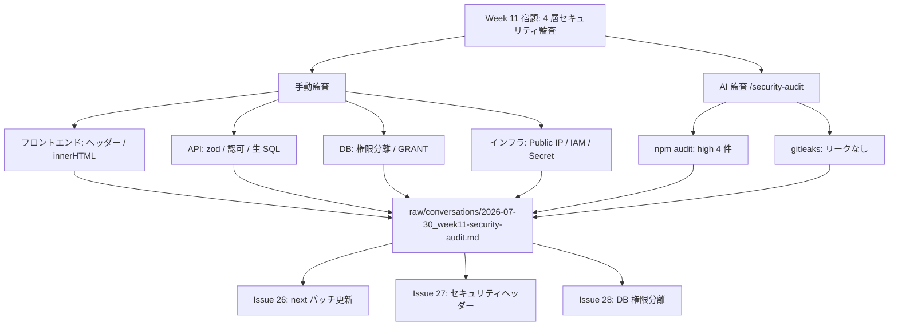

# Changes: Week 11 セキュリティ監査記録の追加

- date: 2026-07-30
- branch: feature/week11-security-audit
- 種別: ドキュメントのみ（コード変更なし）

## 全体フロー

## 追加ファイルの構造

| ファイル | 内容 |
|---------|------|
| `raw/conversations/2026-07-30_week11-security-audit.md` | 監査の本体記録。4 層それぞれの判定表（根拠のファイル・行付き）、AI 監査結果、対策の優先順位と対応 Issue 番号 |
| `raw/issues/2026-07-30_26/next-security-patch.md` | Issue #26 の背景・設計メモ（advisories の ID、パッチ更新方針） |
| `raw/issues/2026-07-30_27/security-headers.md` | Issue #27 の背景・設計メモ（CSP 調整方針、Report-Only の検討） |
| `raw/issues/2026-07-30_28/db-role-separation.md` | Issue #28 の背景・設計メモ（ユーザー分離設計、migrate 分離、Secret 2 本化） |

## 読み方

監査の結論だけ知りたい場合は `raw/conversations/2026-07-30_week11-security-audit.md` の「決定事項」を読む。各対策の実装方針は Issue 側と `raw/issues/` の設計メモに分離してある。
